# Managing a task's product allocations tab

Some projects are broken down into tasks — smaller pieces of work that sit directly under the project (separate from jobs). Each task has its own **Products** tab, where you can give that specific task a slice of the materials/products already planned for the whole project, track how much of that slice has actually been used, and adjust the plan if things change.

## Where to find it

Open a project, go to its **Tasks** list, and open a task. On the task's page you'll see two tabs: **Overview** and **Products**. Click **Products**.

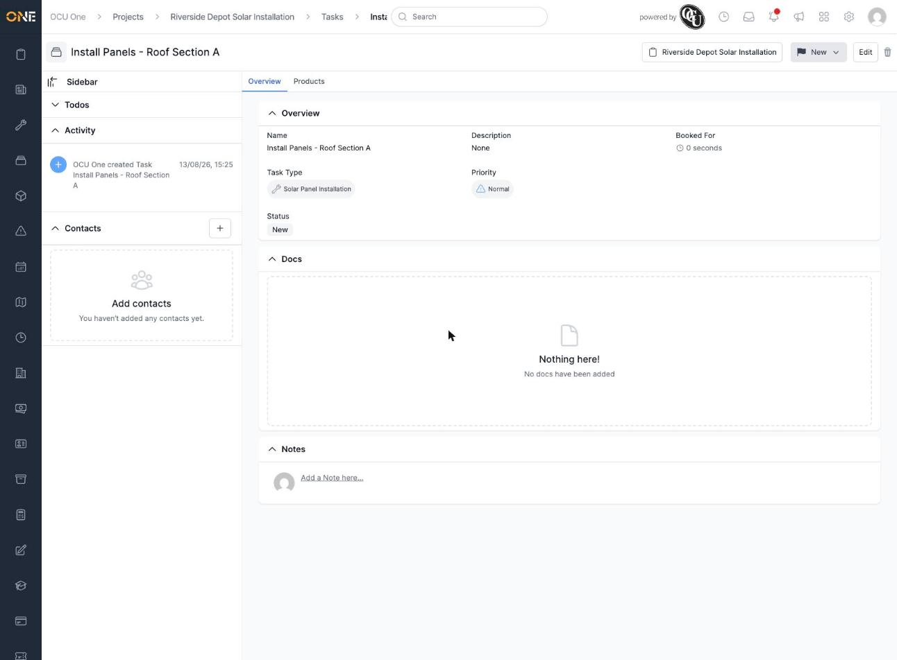

When a task has nothing allocated to it yet, the Products tab looks like this — an empty table with a search box and an **Allocate from** button above it. Unlike a project or job, a task's Products tab doesn't have its own **+ Product** button — you can only give a task products that have already been planned at the project level, using **Allocate from** below.

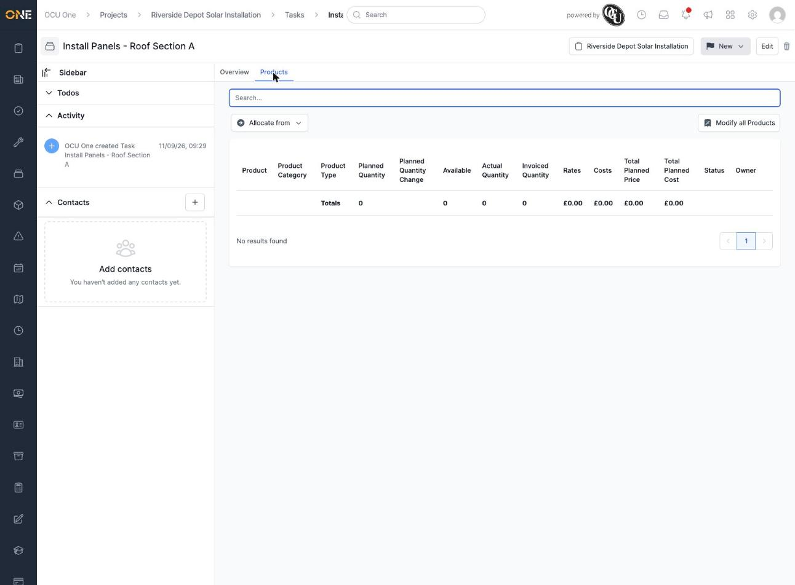

## Giving the task a slice of the project's materials

The most common way to add something to a task is to pull it from what's already been planned at the project level, rather than creating something new from scratch. Click **Allocate from** and choose the project.

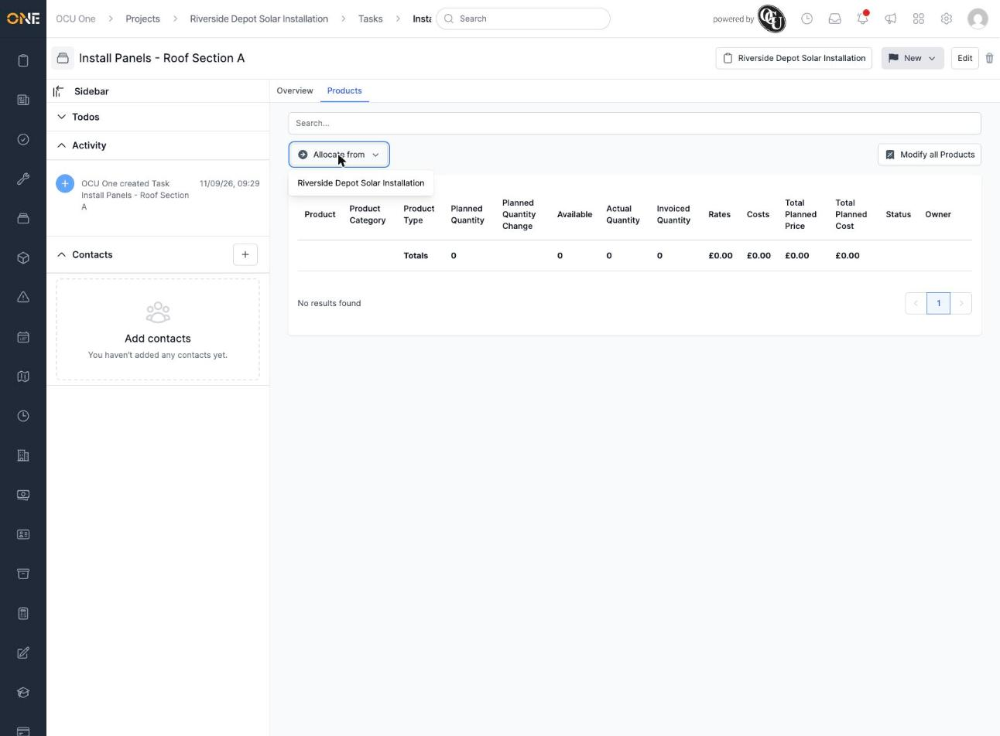

This opens a screen listing everything the project has planned that still has quantity free to hand out ("Solar Panel 400W" in this example, with 30 units planned on the project and all 30 still available). Enter how much of it this task needs.

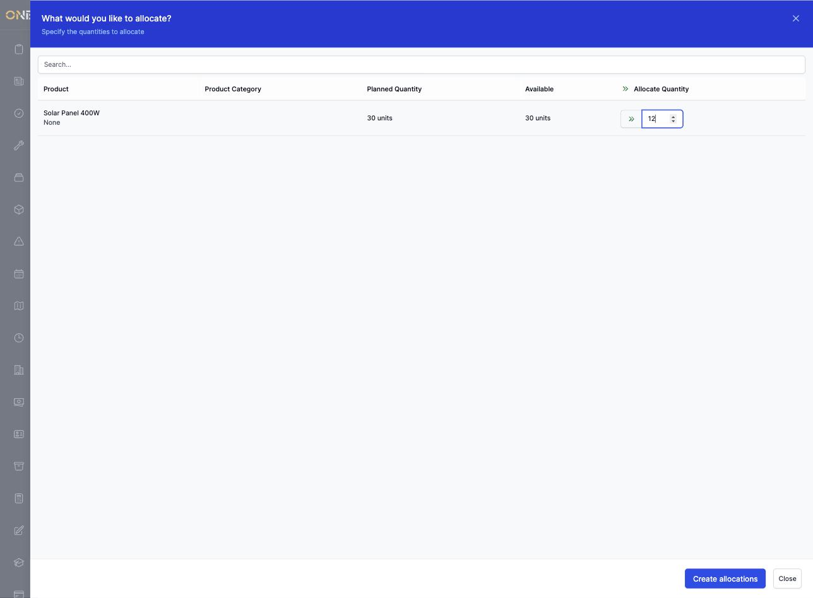

Click **Create allocations**, and the task's Products tab now shows that item with its own row:

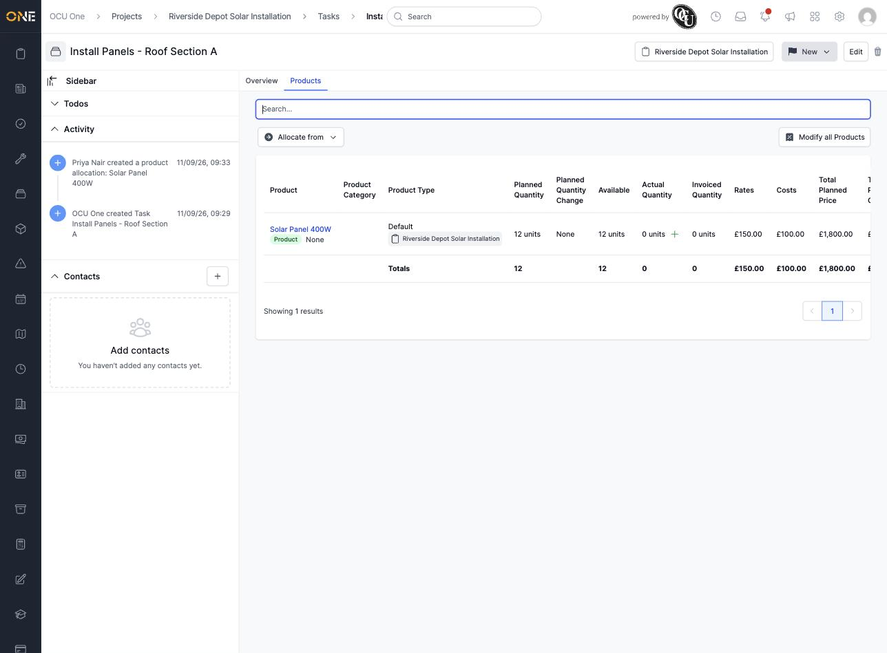

**Good to know:** you can only pull a product onto a task if the project itself already has that product planned with some quantity left over. If the "Allocate from" list is empty, either the project has nothing set up yet, or everything on it has already been fully handed out to other tasks.

## Reading the table

Each row on the Products tab tells you:

- **Product** — what it is.
- **Product Category** / **Product Type** — how it's classified.
- **Planned Quantity** — how much of it this task currently plans to use.
- **Planned Quantity Change** — shows the task's original quantity in brackets and the difference, once it's been changed (e.g. `(12) +2` means it started at 12 and has gone up by 2).
- **Available** — how much of this task's own allocation could still be broken down further (relevant if a task's work is split down even further; usually not something you need to worry about).
- **Actual Quantity** — how much has actually been recorded as used, with a small **+** to add a new record.
- **Invoiced Quantity** — how much of it has made it onto an invoice.
- **Rates** / **Costs** — the sell and cost price per unit.
- **Total Planned Price** — the planned quantity multiplied by its rate.
- **Status** and **Owner**.

## Viewing the full picture behind an allocation

Click the product's name in the row to open its details. Alongside the basics, there's a **Product Allocation Map** showing exactly how this task's slice relates back to the project's overall plan — the project's total planned quantity and how much of it is still free, next to this task's own planned quantity and how much it's actually recorded.

Scrolling down, the **Quantities** section repeats the task's own planned quantity, with a **Change Planned Quantity** link next to it.

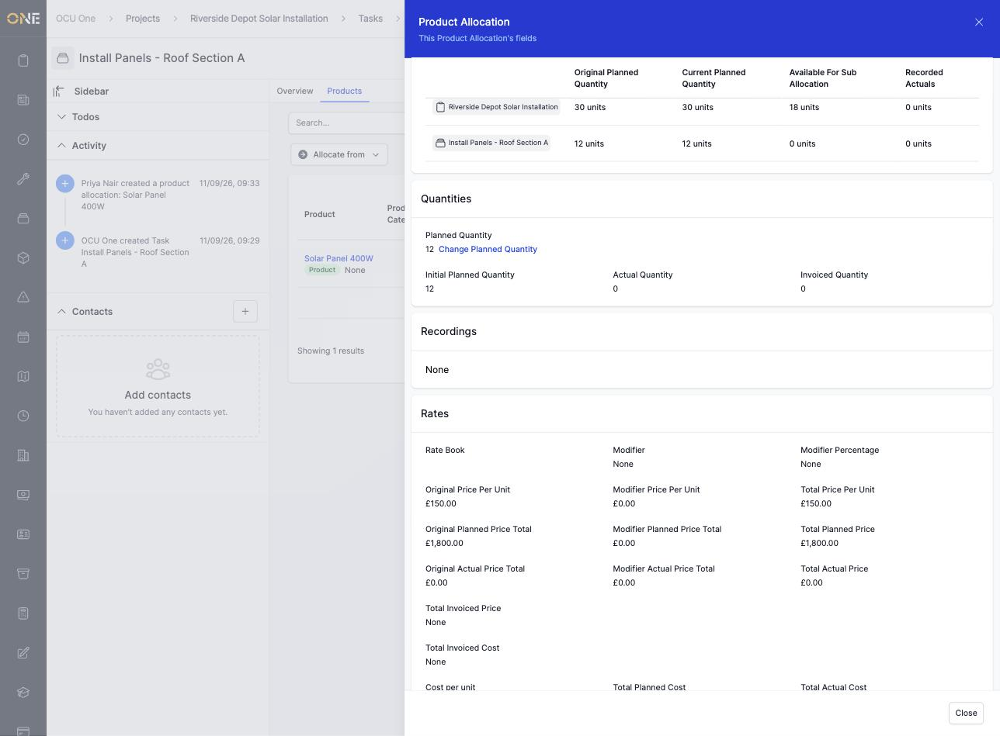

## Changing the planned quantity

If the amount of work changes after the task's already been set up, click **Change Planned Quantity**. You'll be asked for the new amount and a reason for the change — this keeps a record of why the plan moved, not just that it did.

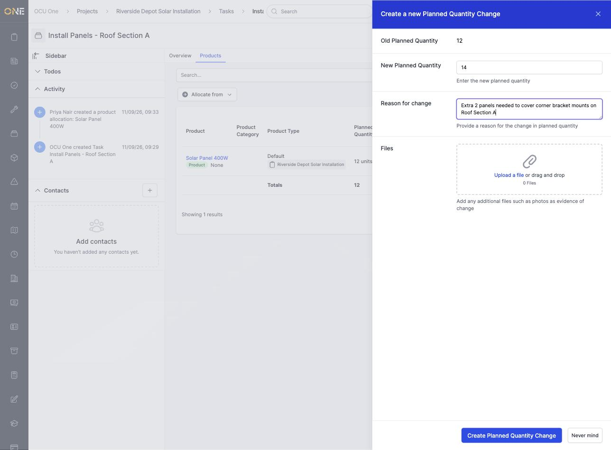

Once submitted, the Product Allocation Map immediately reflects the new figure, and the task's own available quantity on the project updates too (here, the project's remaining balance drops from 18 to 16 units because the task now needs 14 instead of 12):

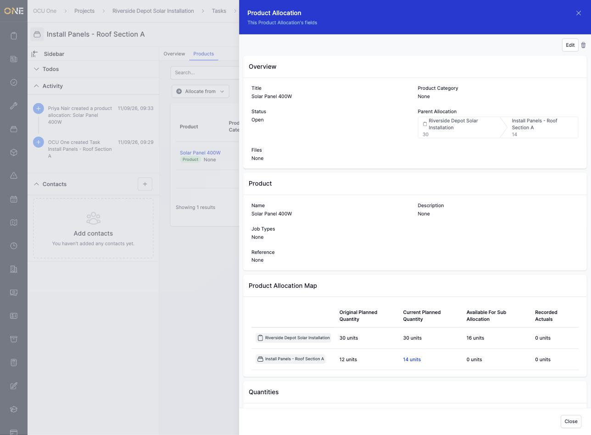

Back on the Products tab, the row now shows the new planned quantity, and the **Planned Quantity Change** column shows exactly what changed:

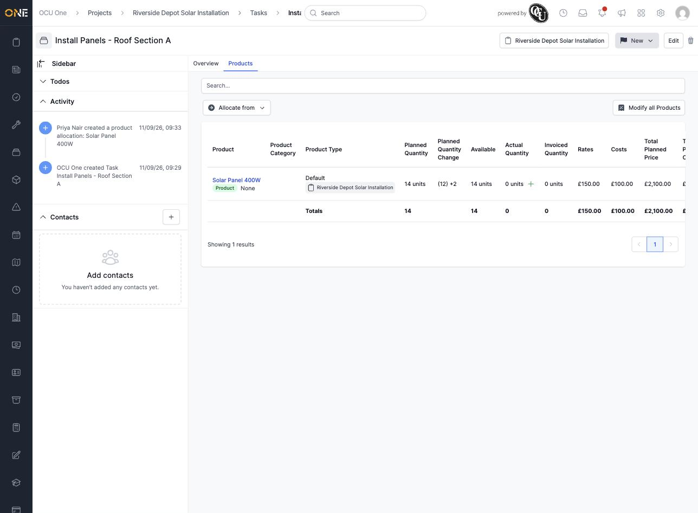

## Recording actual usage

To log how much has actually been used, click the small **+** next to the **Actual Quantity** figure on the row. This opens a short form: who completed the work, when, how much was used, and an optional note or supporting files (like photos).

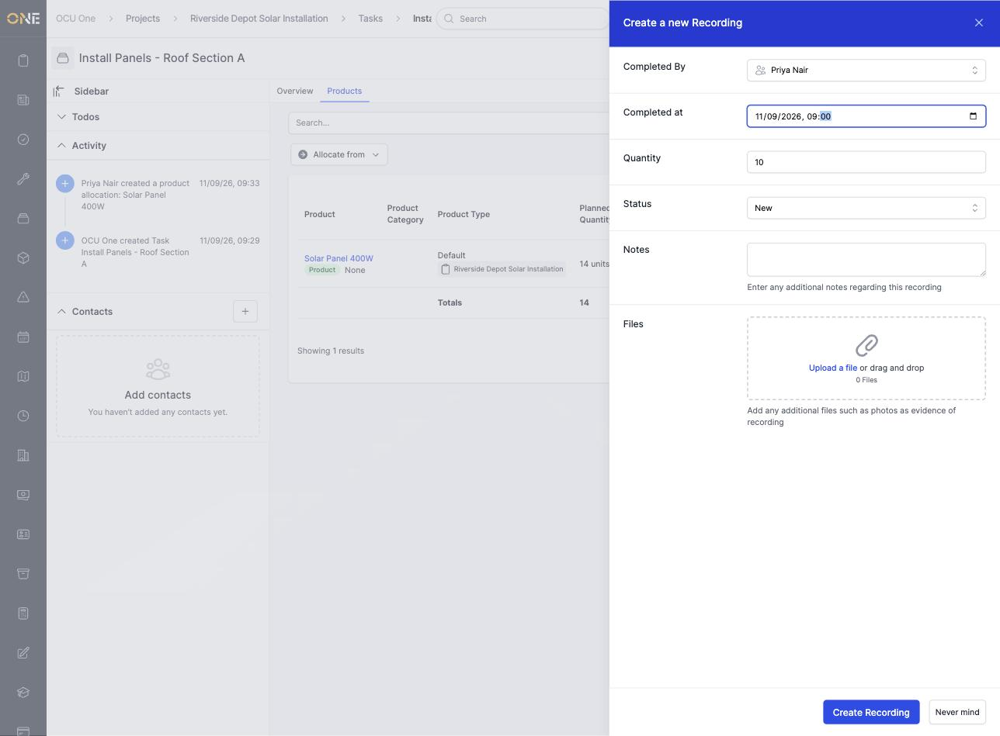

Once saved, the Products tab shows both figures side by side, so you can see the plan against reality at a glance — here, 14 units planned against 10 units actually recorded so far:

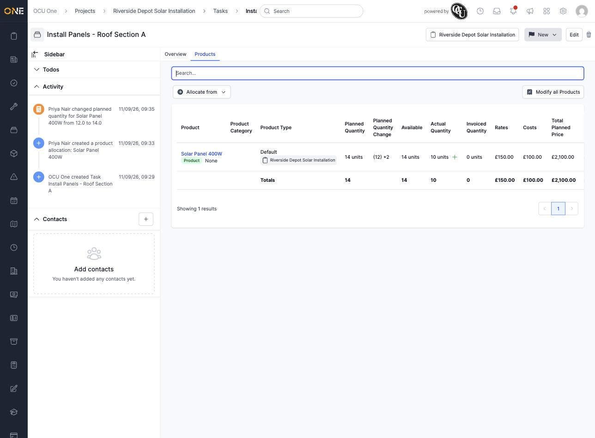

## Other things on this tab

- **Modify all Products** lets you apply a rate adjustment across everything allocated to the task at once.

This covers a less common situation and is worth exploring separately if you need it.
