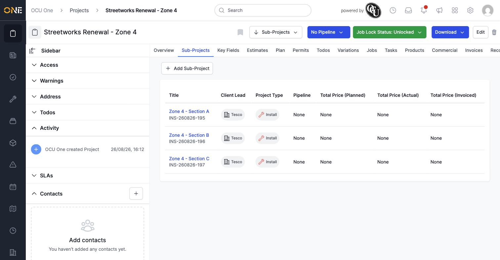
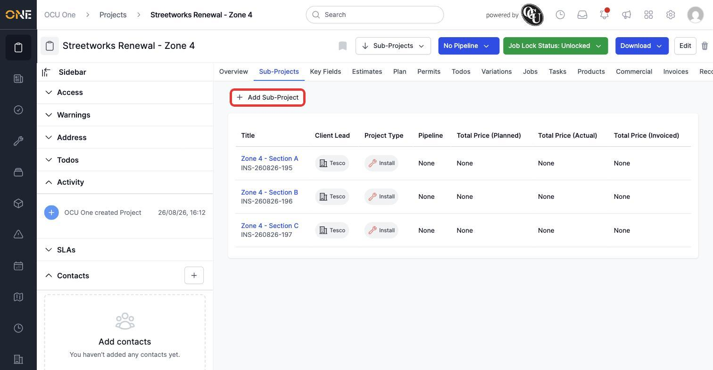
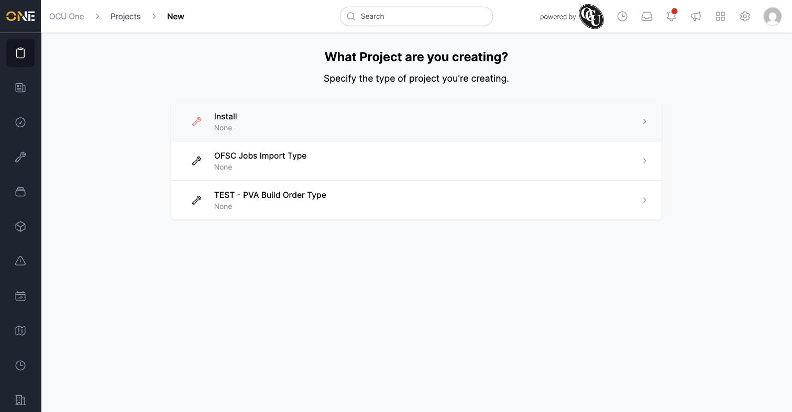

# Managing sub-projects on the Children tab

Larger pieces of work are often broken down into smaller projects nested underneath a parent — for example, a big streetworks renewal split into individual sections. The **Sub-Projects** tab on a project shows everything nested underneath it, and is where you add another one.

## Viewing the sub-projects list

Open a project and click its **Sub-Projects** tab (only shown if the project's type supports sub-projects). You'll see a table of every project nested directly underneath it, along with its client, project type, pipeline, and price totals.

*Each sub-project's title, client lead, project type, pipeline, and planned/actual/invoiced price totals.*

Click any sub-project's title to open it directly.

## Adding a sub-project

Click **Add Sub-Project** in the top-left of the tab.

*Click "Add Sub-Project" to create a new project nested under this one.*

This takes you to the same "What Project are you creating?" screen used when creating any new project, except the new project is automatically nested under the one you started from — its client and rate book carry across from the parent, saving you from re-entering them.

*Pick a project type to continue creating the sub-project — see "Creating a new project" for the rest of this form.*

**Worth knowing:** the price columns on this tab (Planned, Actual, Invoiced) only show a value once a sub-project has commercial activity on it — a freshly created sub-project shows "None" in every price column until products are allocated or work is recorded against it.
