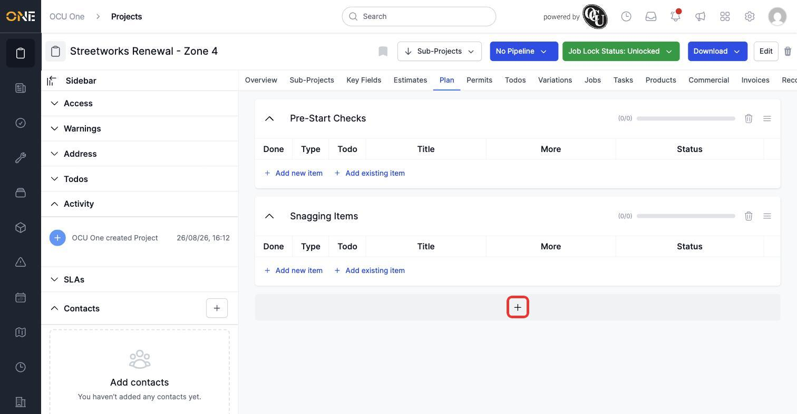
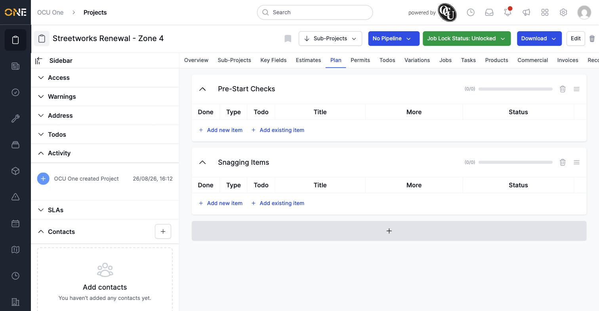
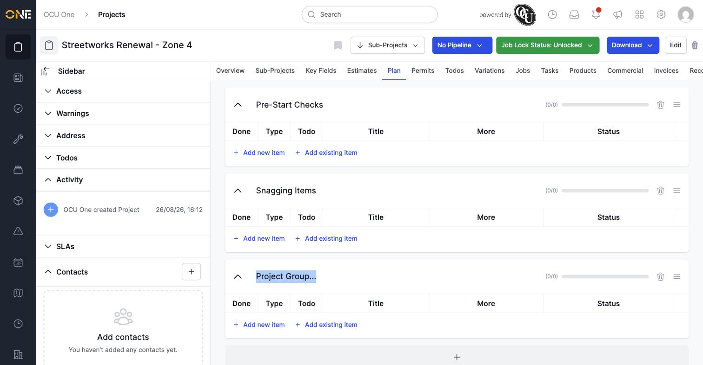
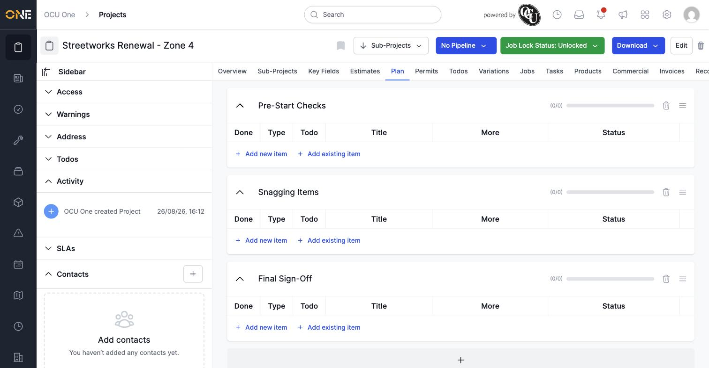
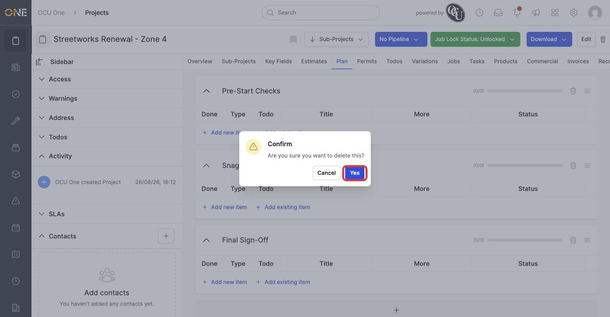
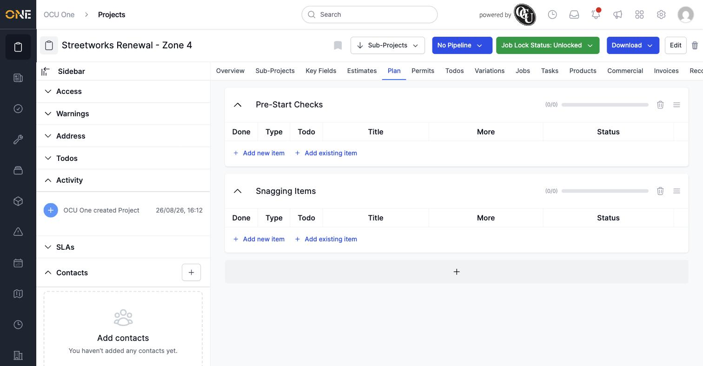

# Managing the project plan (project groups / checklist tab)

The **Plan** tab breaks a project's work into named groups of checklist items — for example, one group for pre-start checks and another for snagging items at the end. This guide covers managing the groups themselves; see the other guides in this section for adding, completing, and reordering the items inside a group.

## Viewing the plan

Open a project and click its **Plan** tab. Each group shows as its own card: a name, a progress count and bar (how many items are done out of the total), and a table of its items underneath.

*Two groups on this project, each currently at 0 of 0 items.*

## Adding a group

Click the **+** bar underneath the last group.

*Click the plus bar below the existing groups to add a new one.*

A new group appears immediately with a placeholder name ("Project Group...").

*The new group starts with a placeholder name, ready to be renamed.*

## Renaming a group

Click directly on the group's name to make it editable, then type the new name and press Tab or click elsewhere to save.

*Click the name to edit it in place.*

*The group is saved under its new name as soon as you click away.*

## Deleting a group

Click the trash icon in the top-right of the group's card, then confirm.

*Confirming removes the group and everything checked off inside it.*

*The group, and every item inside it, is gone for good — there's no undo.*

**Worth knowing:** deleting a group deletes every checklist item inside it too, including any that were already completed. Each group also has a handle icon (the short horizontal lines) next to its trash icon, intended for dragging groups into a different order.
