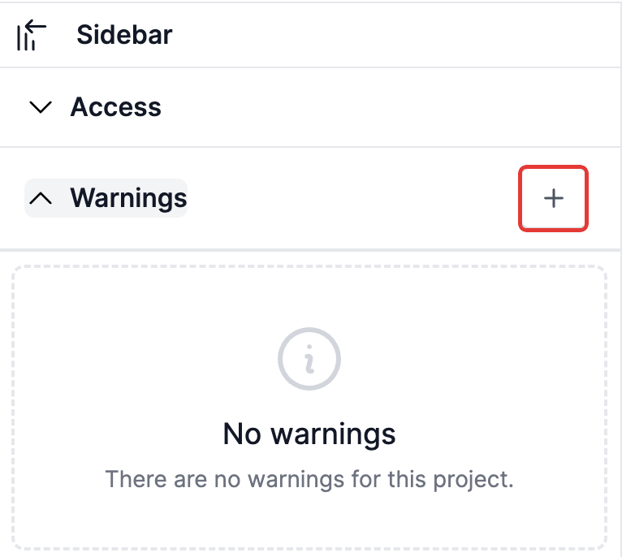
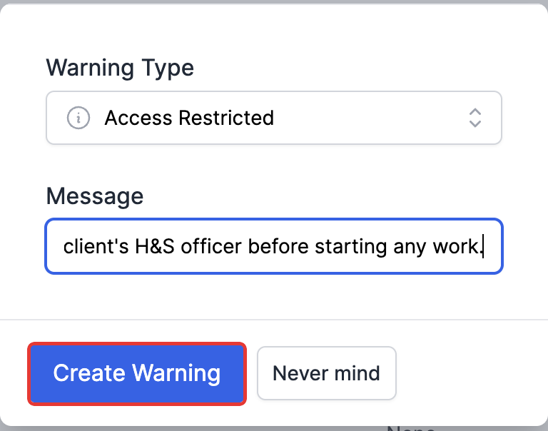
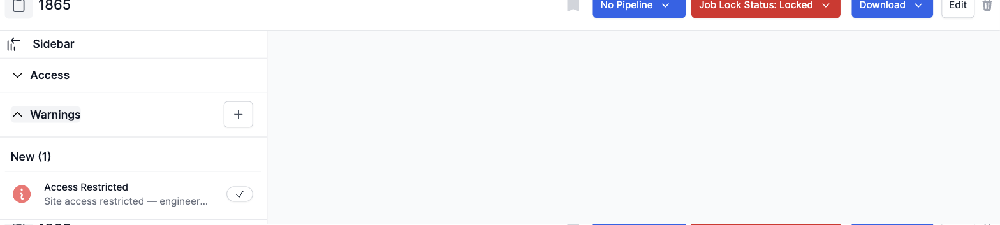

# Raising a warning against a project

A warning flags something that needs attention on a project — a safety issue, an access restriction, anything that should stop and slow work down until it's dealt with. Warnings show up right on the project page, so anyone opening it can see there's something to be aware of.

## Where to find it

On a project's page, open the **Warnings** section in the left-hand sidebar. If there are no warnings yet, it shows an empty state with a **+** button in the top right of the section.

*Click the + button to raise a new warning.*

## Raising a warning

Clicking **+** opens a small form with two fields:

- **Warning Type** — pick from the list of warning types set up for this kind of project (for example, "Access Restricted").
- **Message** — a short note explaining the warning in your own words.

Fill both in, then click **Create Warning**.

*Once both fields are filled in, click Create Warning to save it.*

The new warning appears in the Warnings section under **New**, showing its type, your message, and a checkmark button to acknowledge it later.

*The warning is now visible on the project. Some warning types also lock the project's jobs automatically — notice the "Job Lock Status" button at the top of the page has switched to red ("Locked") because this warning type does that.*

**Worth knowing:** some warning types are set up to automatically lock the project's jobs while the warning is open — the top-right "Job Lock Status" button will switch to red as soon as this kind of warning is raised. The jobs stay locked until the warning is closed (see [Acknowledging and closing a warning](Acknowledging%20and%20closing%20a%20warning.md)).
