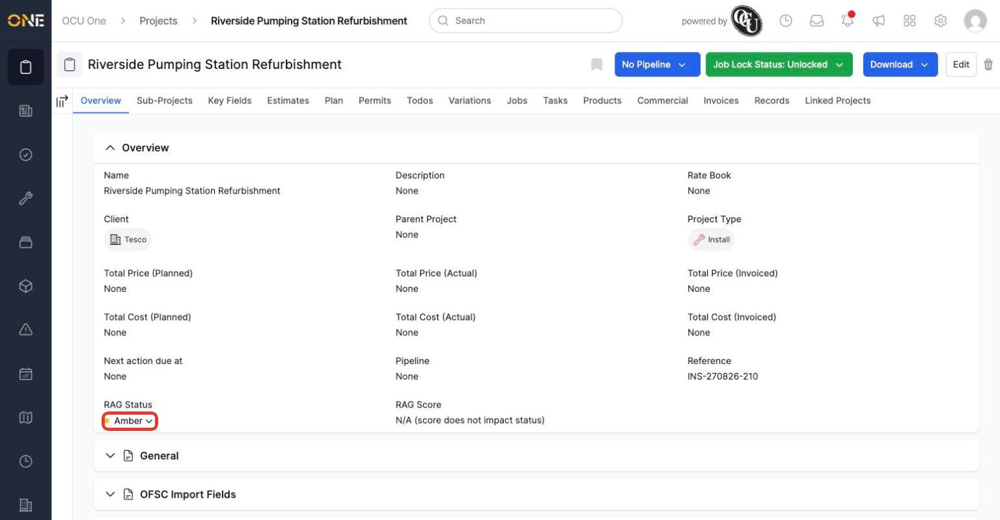
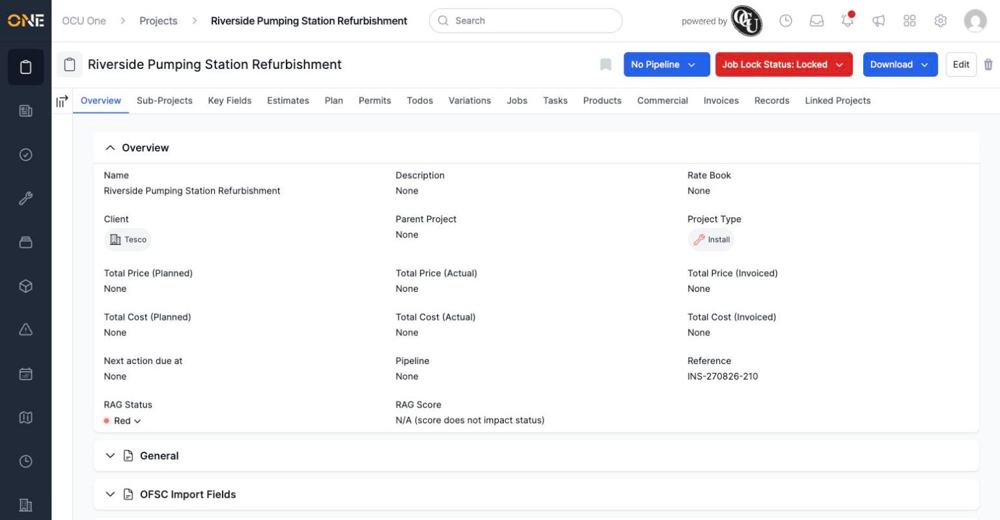

# Setting a project's RAG status

Where a project type has RAG tracking turned on, its overview page shows a **RAG Status** — a simple Green / Amber / Red indicator for how the project is going, alongside a **RAG Score** if your tenant uses scoring. It's a quick visual flag independent of the project's actual stage or pipeline position.

## Where to find it

On a project's **Overview** tab, scroll down past the main details to find **RAG Status**, shown as a coloured dot and a label.

*The current RAG status — here, Amber — sits below the project's core details. Click it to change it.*

## Changing the status

Click the RAG Status label to open a small dropdown of the three options.

*Pick whichever status best reflects the project right now.*

Selecting an option updates the status straight away — no separate save button.

*The project is now flagged Red.*

**Worth knowing:** RAG status is a manual judgement call — the app doesn't set it for you based on dates or budget. Use it to flag when something needs attention (like a missed milestone), and remember to move it back to Green once the issue's resolved, since nothing else will do that automatically.
