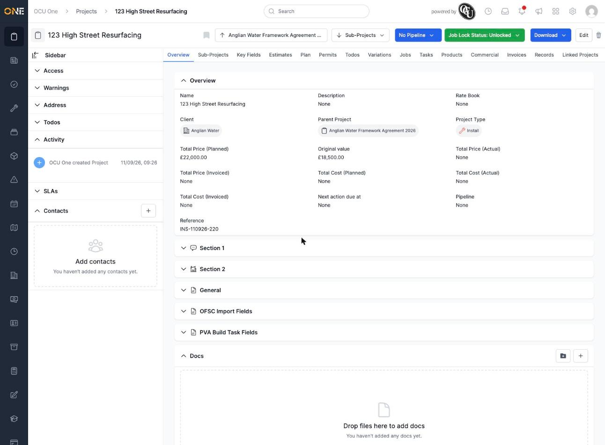
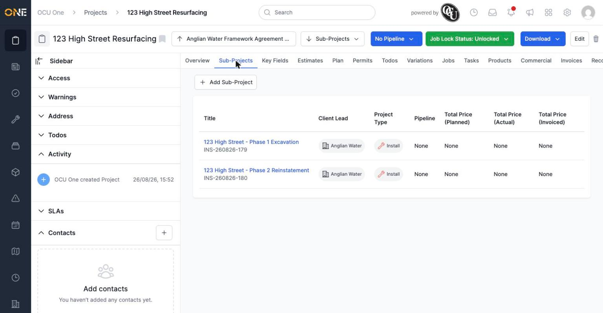

# Viewing a project's overview (main tab)

A project's **Overview** tab is the first thing you see when you open it — a summary of its key details, plus a running activity log of what's happened on it.

## What's shown

*"123 High Street Resurfacing" — a project that itself sits under a parent project.*

Near the top of the page:

- If the project is a sub-project, a chip showing its **Parent Project** appears next to the title — click it to jump straight to the parent.
- If the project has sub-projects of its own, a **Sub-Projects** dropdown appears alongside it.
- **Pipeline** and **Job Lock Status** controls sit on the right, along with **Download** and **Edit**.

The Overview panel itself lists the project's core details — Name, Description, Rate Book, Client, Parent Project, Project Type, the Total Price/Cost figures (Planned, Actual, and Invoiced), the Next Action Due date, Pipeline, and its auto-generated Reference number.

If the project had a planned value recorded early on, an **Original Value** field also appears next to Total Price (Planned) — a snapshot of what the project was originally planned to be worth. It stays fixed even if the current planned figure later changes, so you can always see what was first agreed alongside what's now planned. In this example, the project was originally planned at £18,500.00, but its Total Price (Planned) has since grown to £22,000.00.

## Sub-Projects

If a project has its own sub-projects, they're listed under the **Sub-Projects** tab.

*Both "123 High Street - Phase 1 Excavation" and "123 High Street - Phase 2 Reinstatement" are sub-projects of this one.*

## The sidebar and activity log

On the left, a collapsible sidebar gives quick access to the project's **Access** settings, **Warnings**, **Address**, and **Todos**, plus an **Activity** feed that records everything that's happened on the project — who created it, and any changes made since. Further down, **SLAs** and **Contacts** sections cover any service-level agreements attached to the project and any contacts linked to it.

**Worth knowing:** everything else you can do with a project — its jobs, tasks, estimates, invoices, and so on — lives in the row of tabs across the top of the page (Sub-Projects, Key Fields, Estimates, Plan, Permits, Todos, Variations, Jobs, Tasks, Products, Commercial, Invoices, and more). Which of these tabs actually appear depends on the project's type — not every project type shows every tab.
