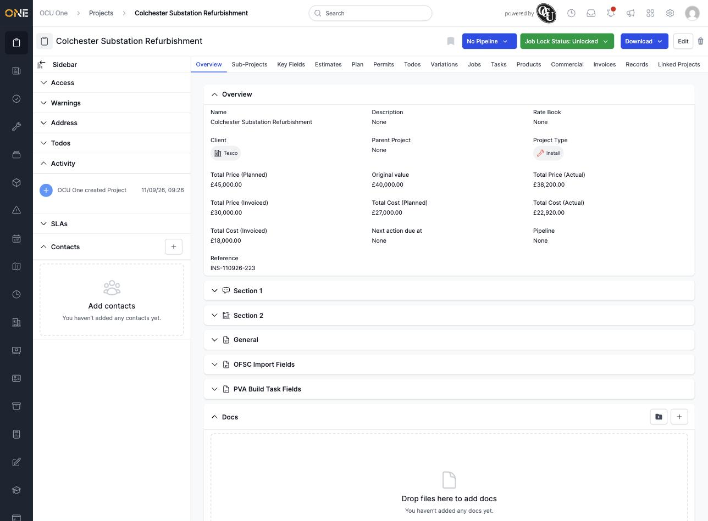
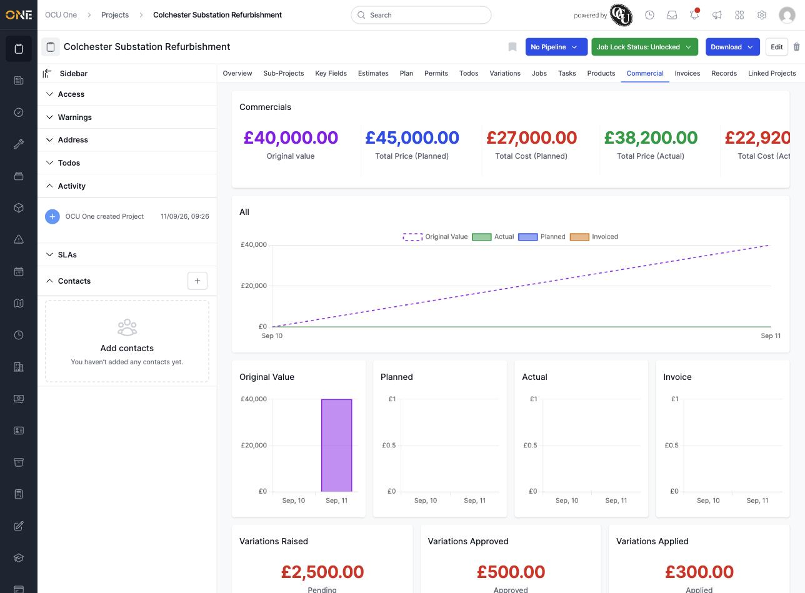
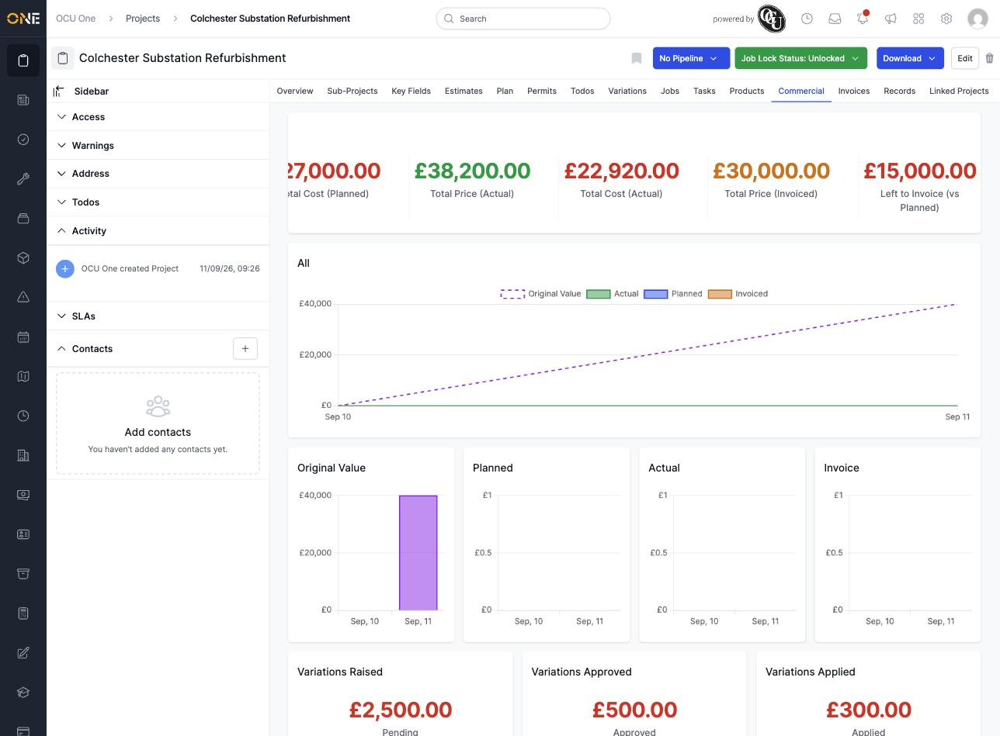
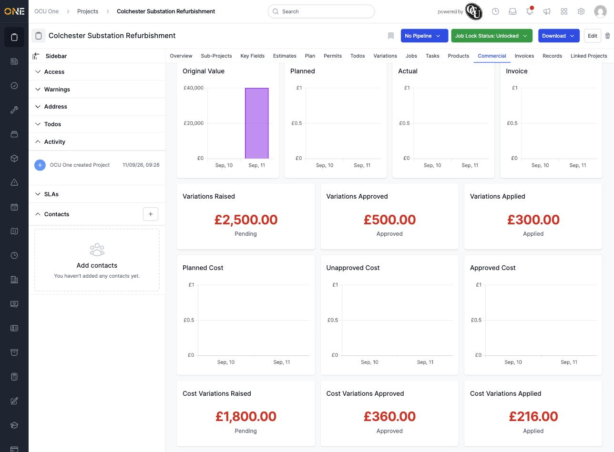
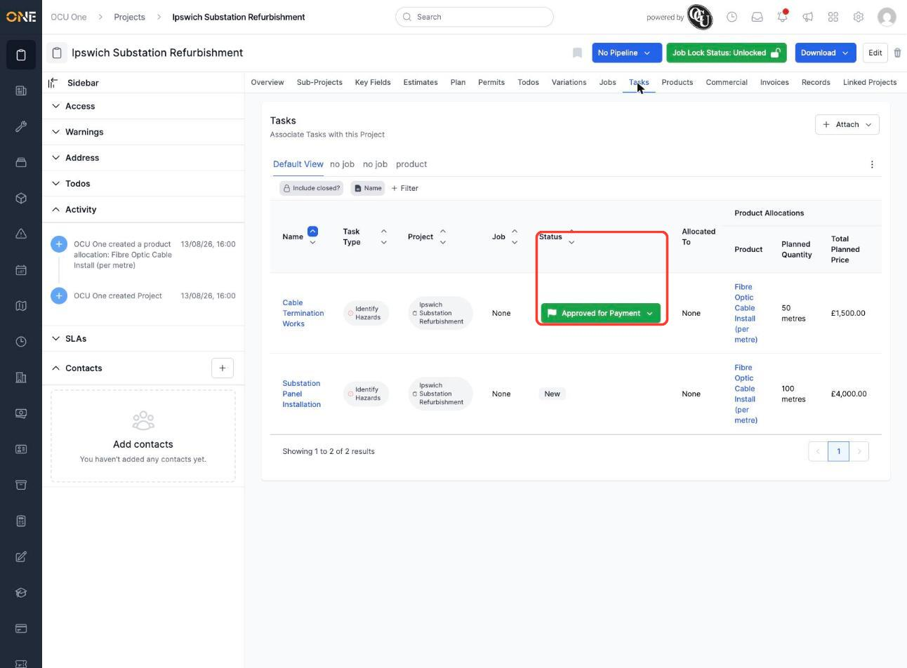

# Viewing an projects's commercial stats dashboard

Every project has a **Commercial** tab that gives you a quick financial snapshot: how much work was planned, how much has actually happened, how much has been invoiced so far, and how any variations (changes to the scope of work) are progressing. It's a read-only dashboard — there's nothing to fill in here, just numbers and charts to check in on.

## Where to find it

Open a project and look at the row of tabs across the top (Overview, Sub-Projects, Key Fields, Estimates, Plan, Permits, Todos, Variations, Jobs, Tasks, Products, **Commercial**, Invoices, Records, Linked Projects). Click **Commercial**.

**Good to know:** not everyone will see this tab. It's only shown to people whose role has permission to view commercial information, so if a colleague says they can't find it, that's most likely why.

## The headline figures

At the top of the Commercial tab is a row of numbers under the heading **Commercials**, pairing what will be charged to the client against what it's costing to deliver:

- **Original Value** — only shown if the project had a planned value recorded early on. It's a snapshot of what the project was originally planned to be worth, and it stays fixed even if the current planned figure later changes — so you can always see what was first agreed alongside what's now planned. In this example, the project was originally valued at £40,000.00, but its Total Price (Planned) has since grown to £45,000.00.
- **Total Price (Planned)** — the value of everything that's been planned for this project so far.
- **Total Cost (Planned)** — what that planned work is expected to cost.
- **Total Price (Actual)** — the value of the work actually completed/recorded against that plan.
- **Total Cost (Actual)** — what the work actually completed has cost so far.
- **Total Price (Invoiced)** — how much of that has been invoiced to the client.
- **Left to Invoice (vs Planned)** — what's still left to invoice, compared against the *planned* total (not the actual total).

The row scrolls sideways — keep going right to see Actual, Invoiced, and Left to Invoice:

**Good to know:** "Left to Invoice" is always measured against what was *planned*, not against what's actually been done. So even if the actual figure is lower than planned, this number won't shrink to match it — it only moves once more has been invoiced.

**Another good to know:** these totals reflect value that's been allocated directly at the project level. If your team is used to adding products/materials onto individual jobs or tasks under a project and expecting those figures to automatically roll up into the headline figures here, they won't — the headline row specifically reflects the project's own commercial figures. (The charts further down are different — see below.)

## The charts

Below the headline figures are price charts, all showing value building up over time (day by day):

- **All** — a combined chart overlaying Actual, Planned, and Invoiced together (and Original Value too, if the project has one), so you can see at a glance how they compare.
- **Original Value** — only shown if the project has one recorded, alongside **Planned**, **Actual**, and **Invoice** as separate charts so each is easier to read on its own. When Original Value is shown, these charts sit at four across instead of three, to make room.

Each chart's horizontal axis is a date range running up to today, and the value climbs as work is planned, completed, or invoiced on each day.

## The variations cards

Next are three cards, one for each stage a variation (a change to the originally agreed scope of work) can be in, on the price side:

- **Variations Raised** — the total value of variations still **Pending** a decision.
- **Variations Approved** — the total value of variations that have been **Approved** but not yet carried out.
- **Variations Applied** — the total value of variations that have already been **Applied** to the project.

**Good to know:** all three numbers are shown in red, regardless of which stage they're in — the colour doesn't mean something has gone wrong, it's just how this card is styled. Look at the label underneath the number (Pending / Approved / Applied) to know which stage you're looking at, not the colour.

If a card shows £0.00, it simply means there are no variations at that stage yet — it isn't an error.

## The cost side

Below the price-side variations cards are the equivalent charts and cards for **cost** — what this project is spending, rather than what it's charging:

- **Planned Cost** — the total cost of everything planned, combining both the project's own plan and the plans on every task underneath it.
- **Unapproved Cost** — the planned cost of tasks that haven't yet had their costs approved for payment.
- **Approved Cost** — the planned cost of tasks whose costs *have* been approved for payment (or already paid).
- **Cost Variations Raised / Approved / Applied** — the same three variation stages as before, but showing their cost impact instead of their price impact.

**Good to know:** "Unapproved Cost" and "Approved Cost" are driven by each task's own status, not by anything you set on this tab directly. A task sitting at a status like **New** counts toward Unapproved Cost; once that task's status is moved on to **Approved for Payment** (or **Paid**), its cost moves into the Approved Cost figure instead. You can see and change a task's status from the project's **Tasks** tab:

