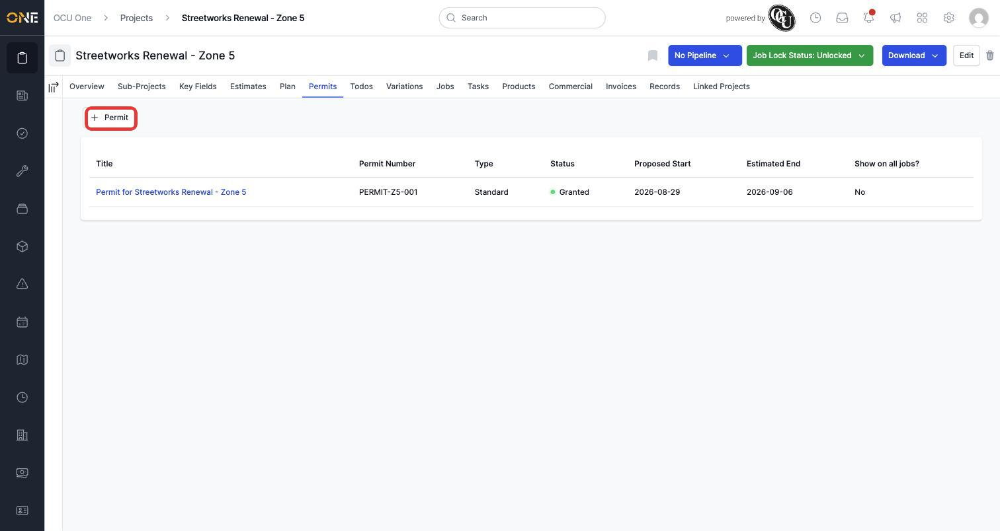
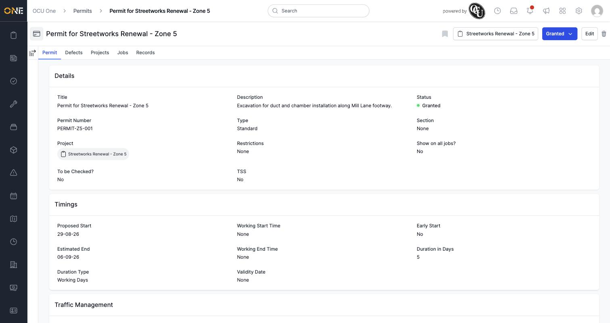
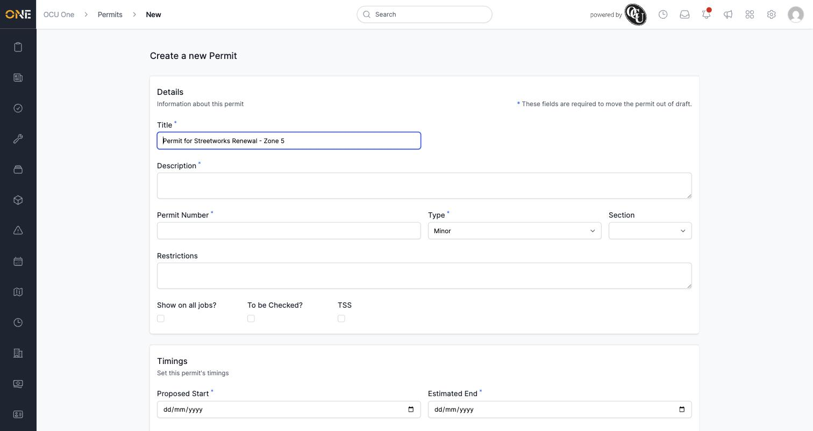

# Viewing and attaching permits to a project

Where work needs a street-works or similar permit, the **Permits** tab on a project tracks it — its type, status, and the dates it covers.

## Viewing existing permits

Open a project and click the **Permits** tab. The table lists every permit's title, permit number, type (**Minor**, **Major**, **Standard**, and others), status (a coloured dot next to it — green for statuses like **Granted**), proposed start and estimated end dates, and whether it shows on all jobs under the project.

*The Permits tab. Click **+ Permit** to add a new one.*

Click a permit's title to open its full details.

*A permit's own page groups its details into Details, Timings, and Traffic Management sections. It also has its own Defects, Projects, Jobs, and Records tabs.*

## Adding a new permit

Click **+ Permit**. The form pre-fills a **Title** based on the project's name, and asks for the details a permit needs before it can move out of draft — fields marked with an asterisk (**Description**, **Permit Number**, **Type**, and the **Proposed Start**/**Estimated End** dates) are required to progress it.

*The new permit form. Fields marked with an asterisk are needed to move the permit out of draft.*

Fill in the details and save to create the permit against the project.

**Worth knowing:** a permit belongs to exactly one project — there's no separate step to "attach" an existing permit to a project the way you can with a linked project; creating a permit from a project's Permits tab is how the two get connected.
