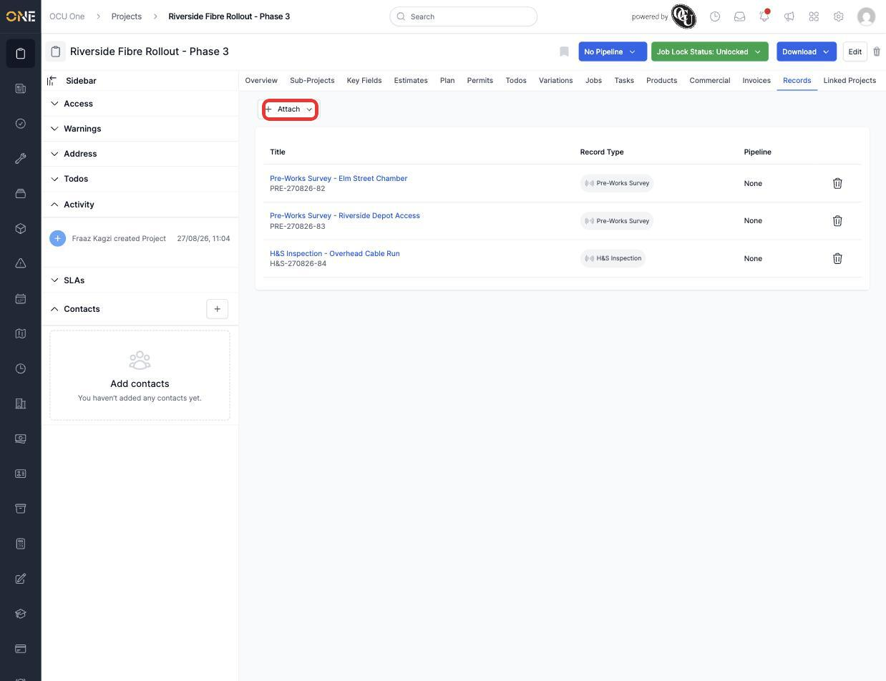
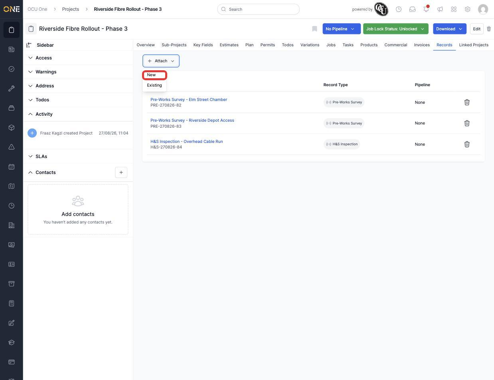
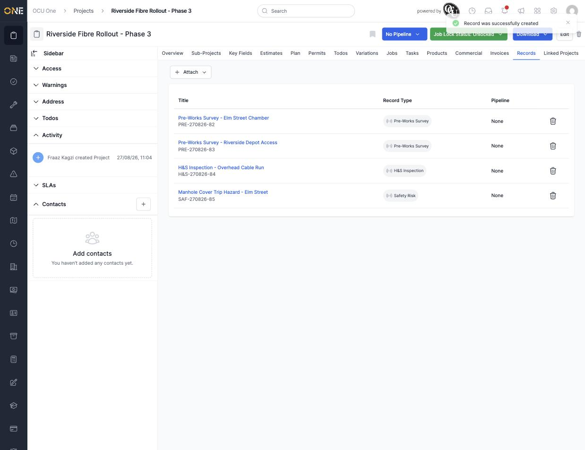

# Viewing and attaching records (surveys/inspections) to a project

A project's **Records** tab lists every record attached to it — surveys, inspections, and other structured documentation that isn't a job, a task, or a file upload. This guide covers seeing what's already attached, and attaching more.

## Viewing attached records

Open a project and go to its **Records** tab. Every attached record is listed with its title, reference, record type, and pipeline (if it's on one).

*The Records tab, showing records already attached to this project. Click **Attach** to add another.*

Click a record's title to open it and see its own details.

## Attaching a record

Click **Attach** at the top of the tab. You get two options:

*Choosing between creating a brand-new record or attaching one that already exists.*

- **New** — create a record from scratch and attach it to this project in one step.
- **Existing** — search for and attach a record that's already been created elsewhere.

Only record types that are set up for this project's type appear when you choose **New** — if a record type you expect isn't listed, it likely hasn't been configured for this kind of project yet.

Choosing **New** takes you to a short form: pick the record type, then fill in its title (and any other fields it has), and click **Create Record**. The new record appears in the list immediately, attached to the project.

*"Manhole Cover Trip Hazard - Elm Street" now appears alongside the records that were already attached.*

**Worth knowing:** attaching a record to a project doesn't move it from anywhere else — a record can be attached to more than one thing at once (a job, an asset, a project) if that's how your organisation tracks it.
