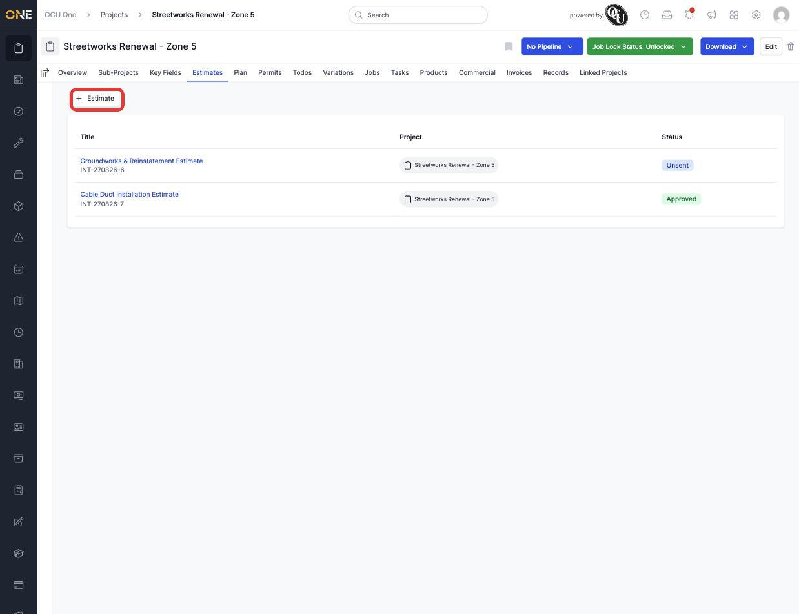
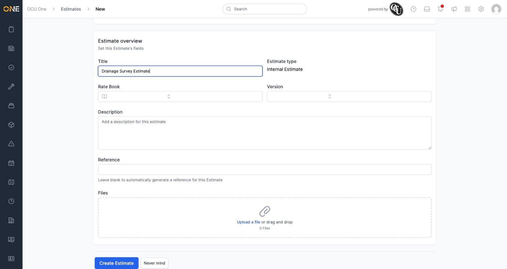
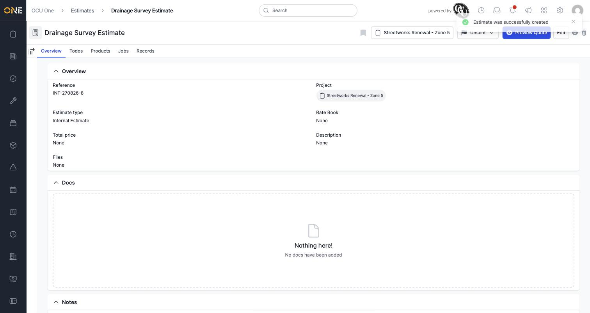

# Viewing and creating estimates on a project

The **Estimates** tab on a project lists every estimate raised for that project — quotes you send out before work is agreed, or internal costings you keep for reference — and lets you start a new one.

## Viewing existing estimates

Open a project and click the **Estimates** tab. Each row shows the estimate's title, its reference, and its status (for example **Unsent** for one still being worked on, or **Approved** once it's been signed off).

*The Estimates tab. Click **+ Estimate** to start a new one.*

## Creating a new estimate

Click **+ Estimate**. If your tenant has more than one estimate type configured, you'll be asked to pick one first — otherwise you're taken straight to the form. Fill in a **Title**, and optionally a **Rate Book**, **Version**, **Description**, and **Reference** (leave the reference blank to have one generated for you automatically). You can also attach files here.

*The new estimate form — only Title is required.*

Click **Create Estimate** to save it.

*A new estimate lands on its own overview page, with its own reference and starting status.*

**Worth knowing:** a brand-new estimate has no price until products are allocated to it — its "Total price" starts out empty. From the estimate's own page you can also add Todos and browse the project's Products and Records via its tabs.
