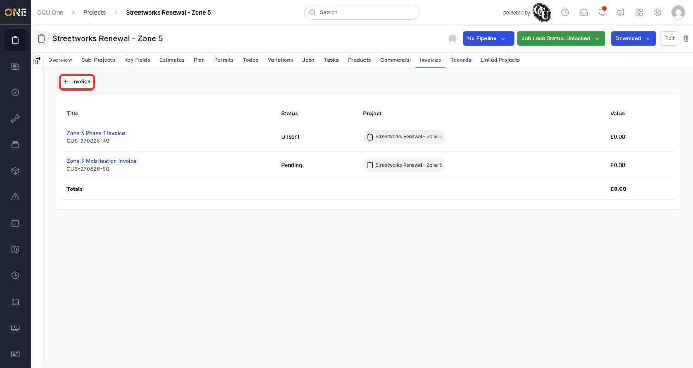
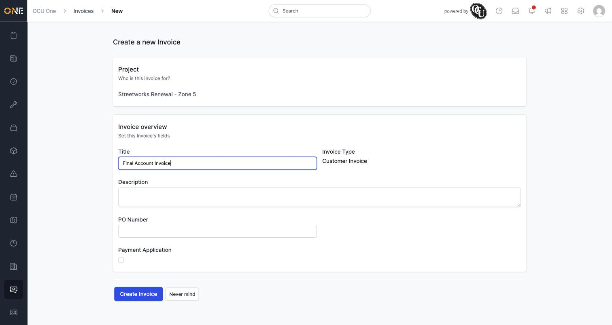
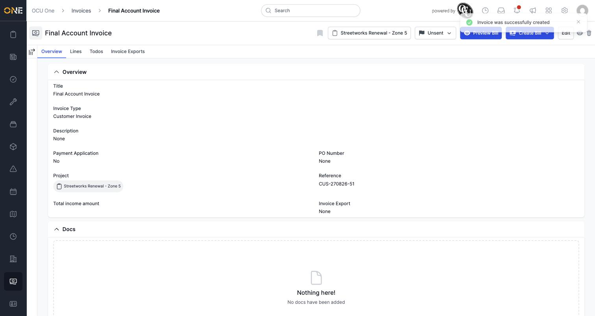

# Viewing and creating invoices on a project

The **Invoices** tab on a project lists every invoice raised against it, with a running total, and lets you raise a new one.

## Viewing existing invoices

Open a project and click the **Invoices** tab. Each row shows the invoice's title, reference, status, and value, with a **Totals** row at the bottom summing everything on the page. Statuses include **Unsent** (still a draft), **Pending** (sent, awaiting payment), **Paid**, **Disputed**, and others depending on how far along it is.

*The Invoices tab, with the running total at the bottom. Click **+ Invoice** to raise a new one.*

## Creating a new invoice

Click **+ Invoice**. If more than one invoice type is set up, pick one first; otherwise you land straight on the form. Fill in a **Title**, and optionally a **Description**, **PO Number**, and whether it's a **Payment Application**.

*The new invoice form — only Title is required.*

Click **Create Invoice** to save it.

*A new invoice lands on its own overview page. From here its **Lines**, **Todos**, and **Invoice Exports** tabs are all available.*

**Worth knowing:** an invoice's income amount comes from the lines added to it, not from a figure you type in directly — a freshly-created invoice has no total until lines are added on its **Lines** tab.
