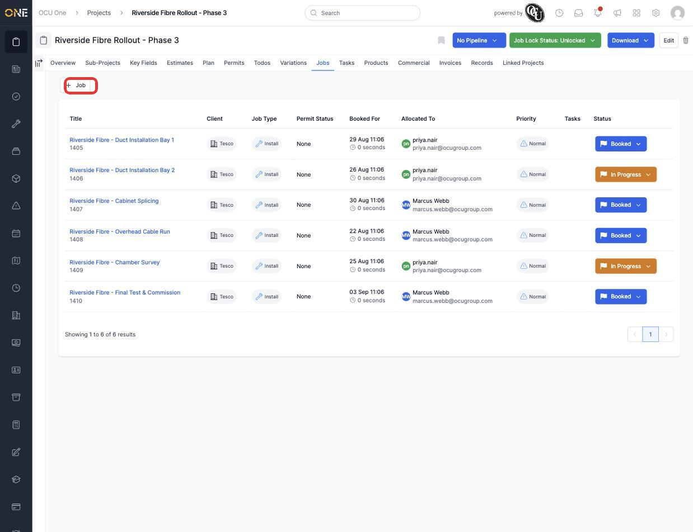
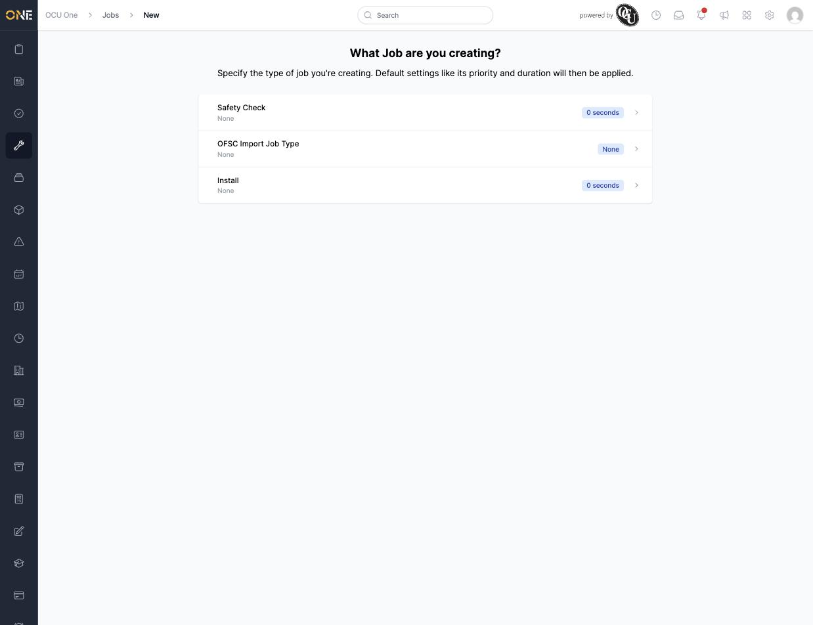
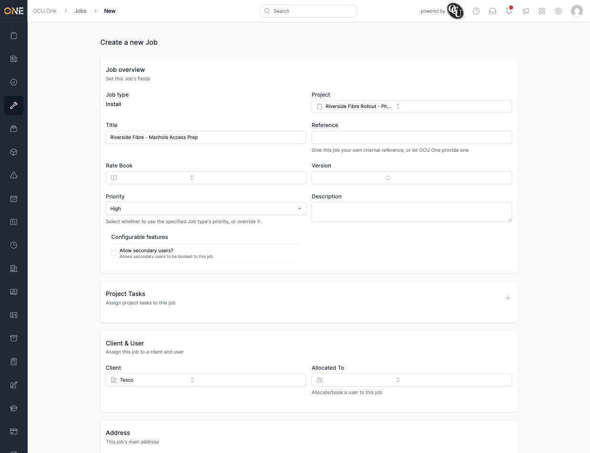
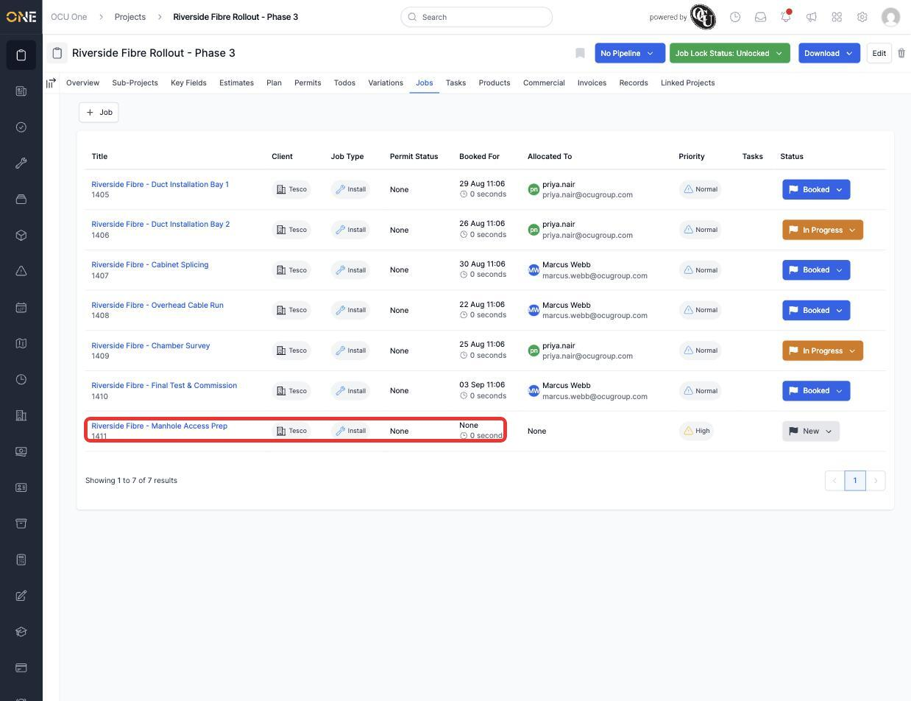

# Viewing and creating jobs from a project

A project's **Jobs** tab lists every job booked under it — the actual work being carried out on site. This guide covers browsing the list and creating a new job directly from the project.

## Viewing jobs on a project

Open a project and go to its **Jobs** tab. Every job is listed with its client, job type, permit status, booked date/time, who it's allocated to, priority, and current status.

*Jobs already booked on this project. Click **Job** to add another.*

Click a job's title to open it and see its full details.

## Creating a new job from the project

Click **Job** at the top of the tab. You're asked which job type you're creating.

*Choosing the job type applies its default settings — priority and duration — to the new job.*

Pick a type and you land on a full job form. The **Project** field is already filled in with the project you started from, so the new job is automatically linked to it. Fill in a title, choose a client, and set anything else the job needs (allocation, address, booked timing).

*The Project field carries over automatically — you don't need to search for it again.*

Click **Create Job** to finish. The new job appears in the project's Jobs list straight away.

*"Riverside Fibre - Manhole Access Prep" now appears alongside the jobs that were already booked, with status "New" since it hasn't been allocated or booked in yet.*

**Worth knowing:** a job created this way doesn't need to be allocated to someone or given a booked time right away — it can sit as "New" until it's ready to be scheduled.
