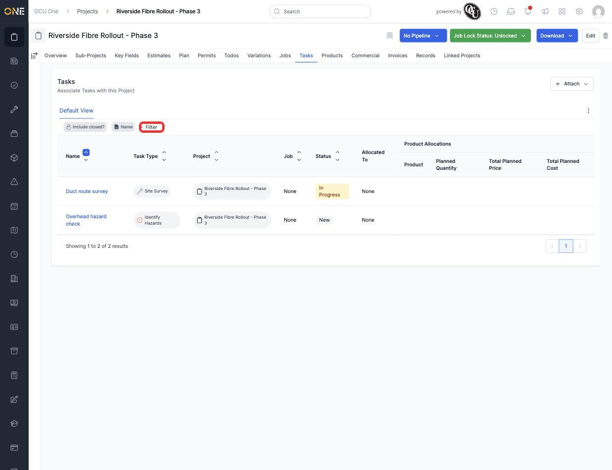
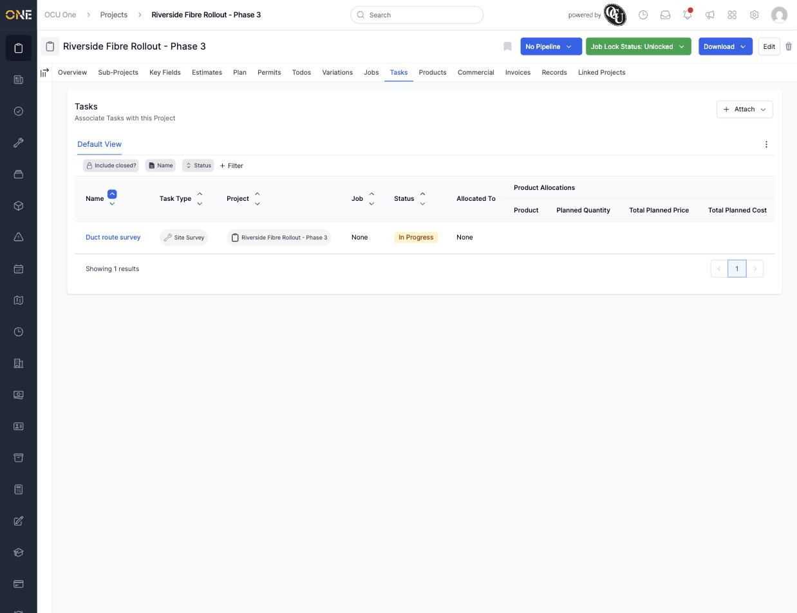

# Viewing and filtering tasks on a project

A project's **Tasks** tab lists every task created directly under it — smaller units of work that don't necessarily need a full job of their own. This guide covers browsing the list and narrowing it down with a filter.

## Viewing tasks on a project

Open a project and go to its **Tasks** tab. Every task is listed with its name, task type, the project it belongs to, the job it's linked to (if any), its status, and who it's allocated to.

*Two tasks on this project — a "Site Survey" task in progress, and an "Identify Hazards" task not yet started. Click **+ Filter** to narrow the list.*

Click a task's name to open it.

## Filtering the list

Click **+ Filter**, then pick which field to filter by from the list (Status, Priority, Task Type, Allocated To, and more). Choosing a field adds it as a chip next to **Include closed?** and **Name**.

Click the new chip to set what to filter for — for example, choosing **Status** shows every status a task can have, so you can pick exactly the one you want.

*After filtering by Status = "In Progress," only the matching task remains — here, "Duct route survey."*

You can add more than one filter at once (for example Status and Task Type together) to narrow the list further. Remove a filter by clicking its chip and choosing **Remove**.

**Worth knowing:** filters only affect what's shown on this tab — they don't change anything about the tasks themselves.
