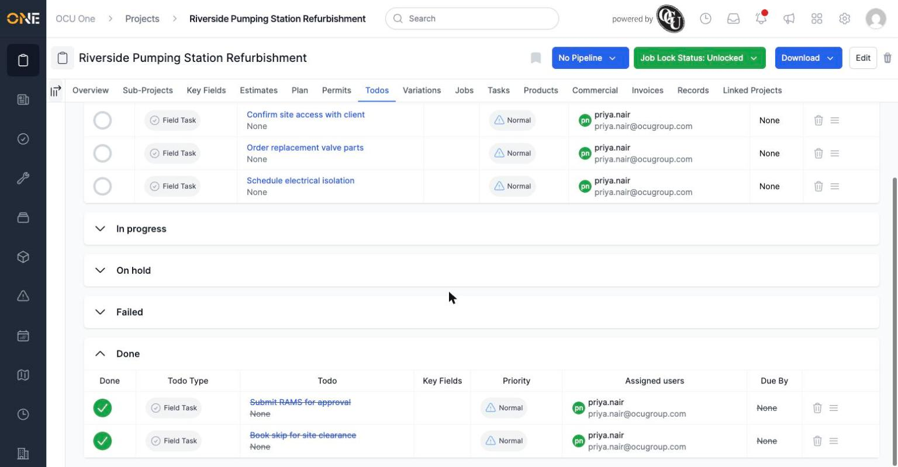
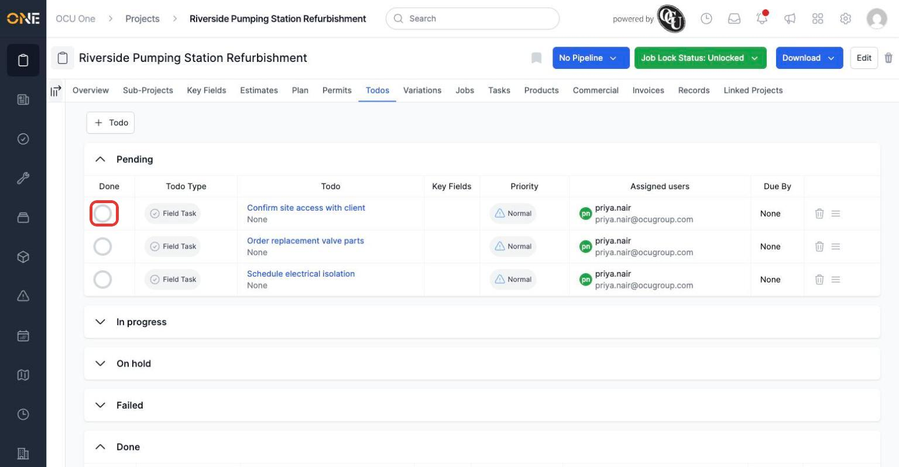
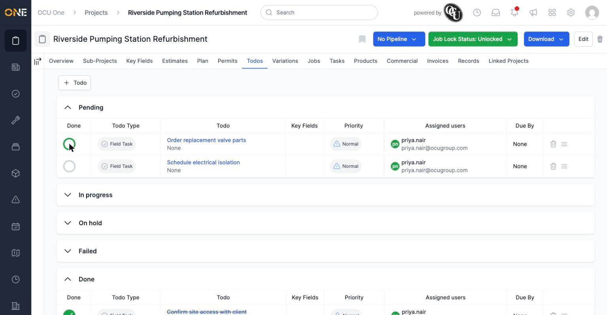

# Viewing and managing to-dos on a project

Every project has its own **Todos** tab — a simple checklist of small tasks tied to that project, separate from the project's jobs, tasks, and plan groups. Use it for things that need doing but don't need the weight of a full job or task, like confirming site access or ordering a part.

## Opening the Todos tab

On a project's page, click the **Todos** tab.

*Todos are grouped by status — Pending, In progress, On hold, Failed, and Done — with each group collapsible.*

Each todo shows its type, who it's assigned to, its priority, and a due date if one's set. Click a todo's title to open it and see or edit its details.

## Marking a todo done

Click the circle in the **Done** column next to any todo to mark it complete.

*Clicking the circle toggles a todo's status.*

The todo moves into the Done group immediately, its title shown with a strikethrough.

*Marking a todo done updates it instantly — no separate save step.*

## Adding a new todo

Click **+ Todo** above the list to add a new one to the project. This is a quick way to note something that needs doing without leaving the project you're already looking at.

**Worth knowing:** this tab is a lightweight checklist scoped to this one project. If you need to track something more substantial — with its own status workflow, product allocations, or a PDF export — that's what a project's **Tasks** tab is for instead.
