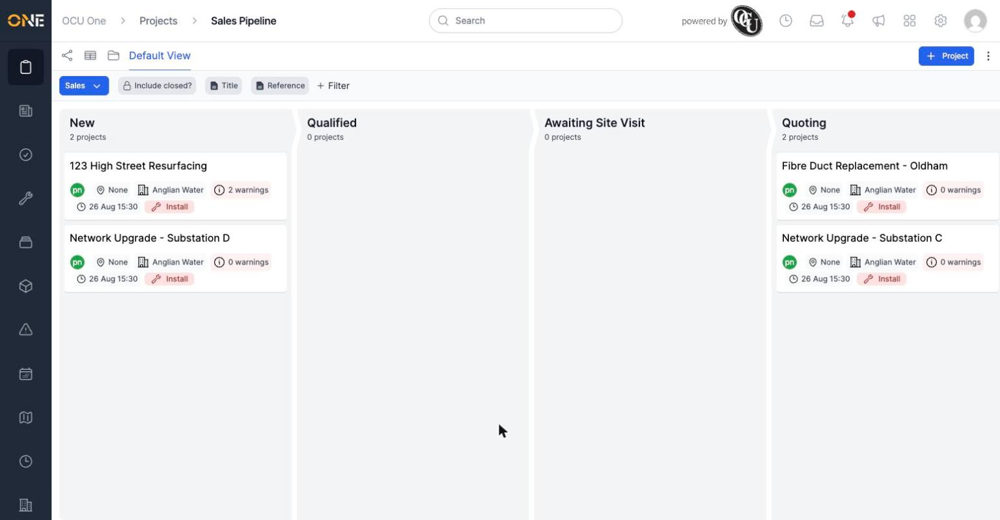
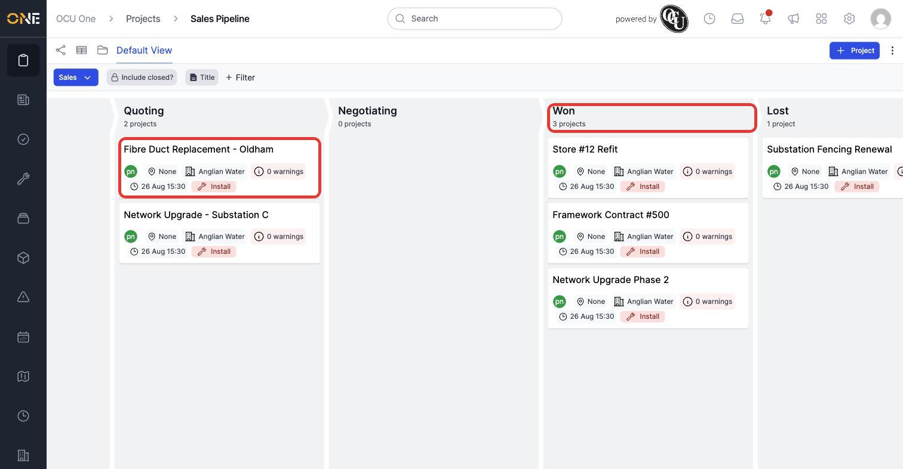
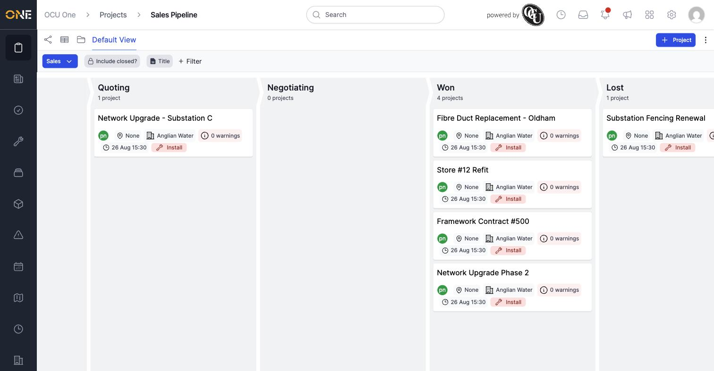

# Viewing and moving projects on the pipeline (kanban) board

If a project's type is tracked through a pipeline, you can view it as a board — one column per stage, with each project shown as a card. This makes it easy to see, at a glance, how many projects are at each point in the process, and move one forward (or back) with a drag.

*The pipeline board. Each column is a stage; each card is a project currently in that stage. Scroll right to see further stages.*

## Reading a card

Each card shows the project's title, its owner, postcode (if set), client, warning count, when it was last touched, and its Project Type. Projects with warnings or in an unusual state stand out at a glance without opening them.

## Switching pipelines

If more than one pipeline exists, use the pipeline picker at the top left (labelled with the current pipeline's name, e.g. "Sales") to switch between them. Each pipeline has its own set of stages and its own board.

## Moving a project between stages

Click and drag a card from one column and drop it in another to move the project to that stage.

*Dragging the card from Quoting into the Won column moves the project to that stage.*

*The move takes effect immediately — no separate save step. The project's stage is updated everywhere else it's shown too (the projects list, its own overview page, and so on).*

**Worth knowing:** moving a card is the same action as changing a project's stage from anywhere else in the app — there's nothing pipeline-board-specific about the change itself, it's just a faster way to do it visually. As with the main projects list, **Include closed?** and filters are available here too, so you can narrow the board down to just the projects you care about before scanning it.
