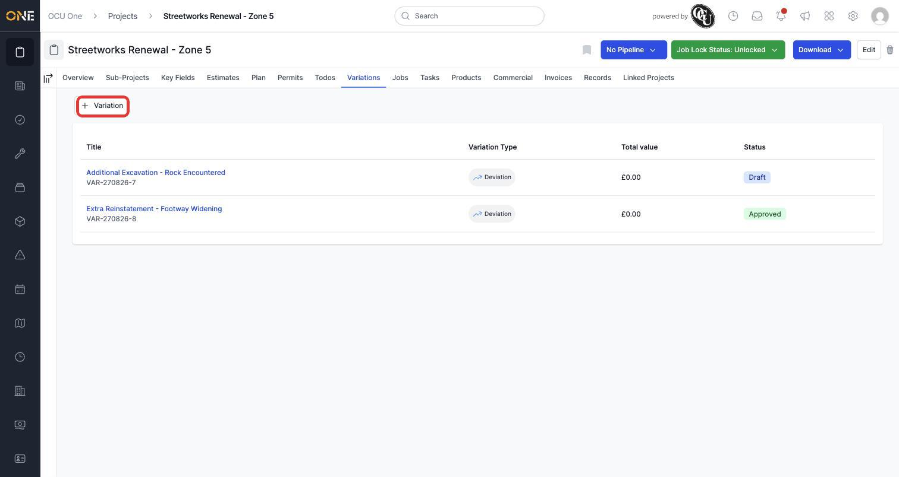
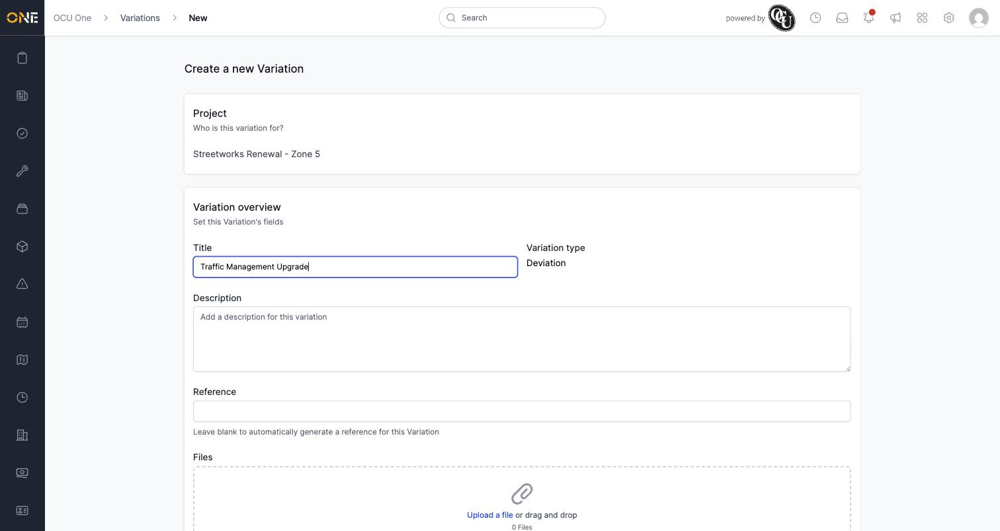
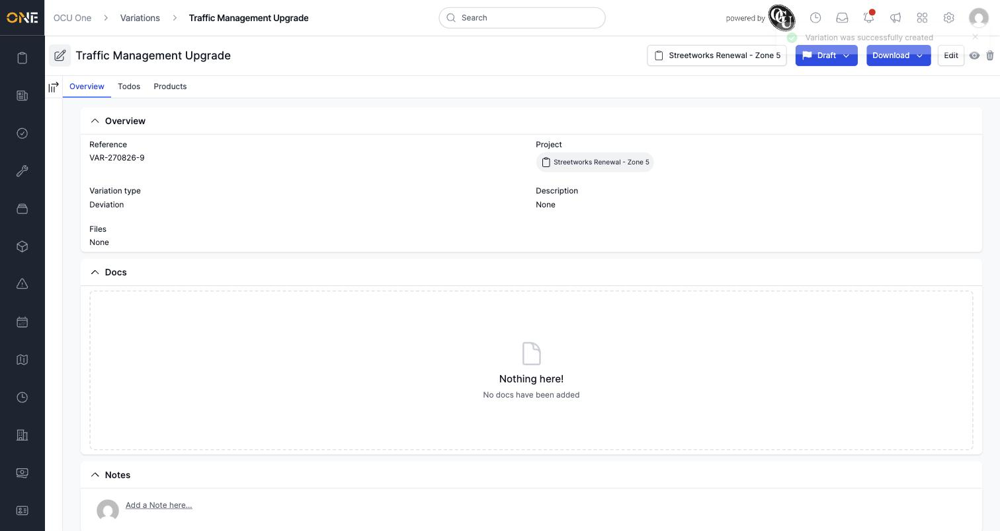

# Viewing and raising variations on a project

A **Variation** records a change to the agreed scope of work on a project — extra work, a deviation from the original plan — and what it's worth. The **Variations** tab lists every variation raised on a project and lets you raise a new one.

## Viewing existing variations

Open a project and click the **Variations** tab. Each row shows the variation's title, its type, its total value, and its status — for example **Draft** while it's still being put together, or **Approved** once it's been signed off. Other statuses (**Pending**, **Applied**, **Rejected**) track it further through review.

*The Variations tab. Click **+ Variation** to raise a new one.*

## Raising a new variation

Click **+ Variation**. If more than one variation type is configured, pick one first; otherwise you land straight on the form. Fill in a **Title**, and optionally a **Description**, **Reference**, and any files that support the change.

*The new variation form — only Title is required.*

Click **Create Variation** to save it. It's created in **Draft** status.

*A new variation lands on its own overview page. Its **Todos** and **Products** tabs are available from here, and a **Download** button lets you preview or export it as a PDF.*

**Worth knowing:** like an estimate, a variation's value comes from the products allocated to it rather than a figure you type in — a newly raised variation shows £0.00 until products are added.
