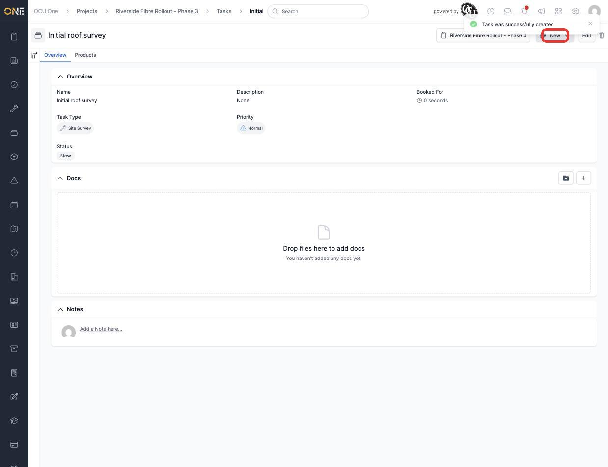
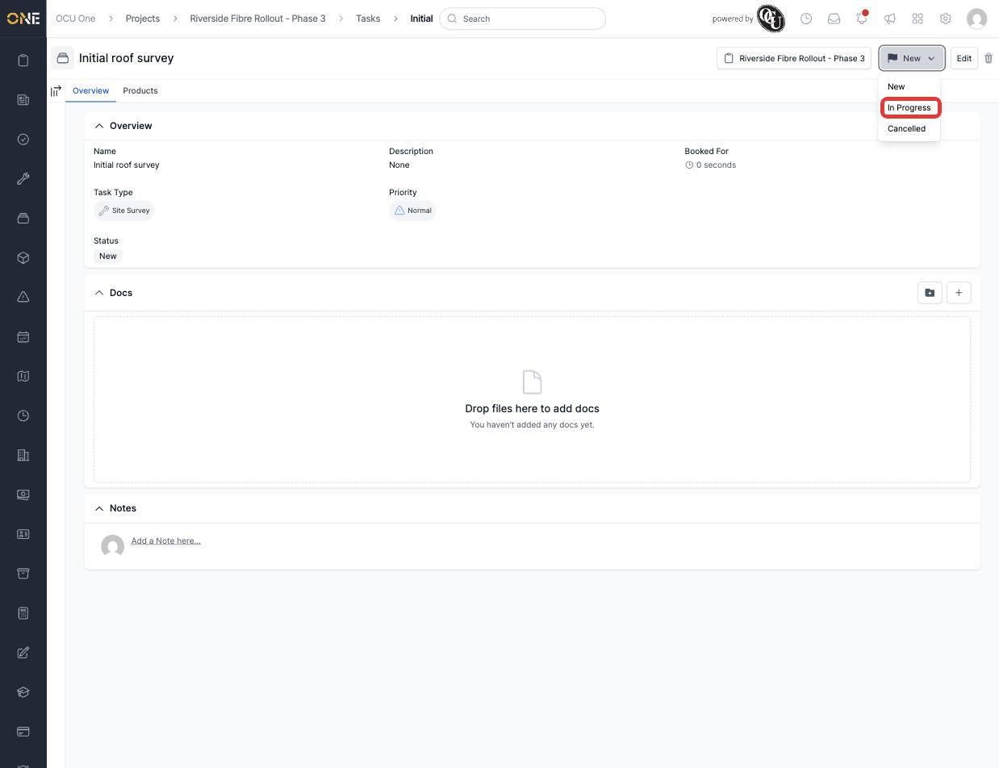
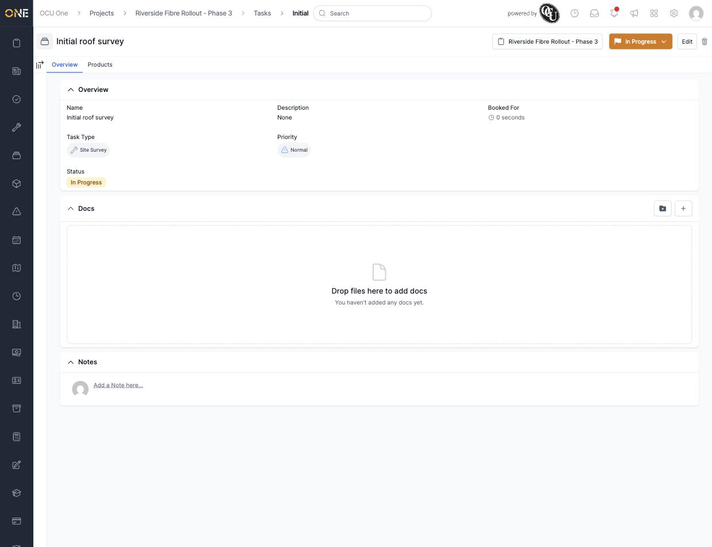

# Viewing and working a task's overview tab

Once a task exists, its own page is where you check its details and move it forward. This guide covers the Overview tab and changing a task's status.

## The Overview tab

Open a task (from the project's Tasks tab, or directly). The **Overview** tab shows its name, description, task type, priority, booked time, and current status, along with a Docs area and Notes.

*"Initial roof survey" just after being created — status "New" in the top right.*

## Changing the task's status

Click the status button in the top right to see what it can move to next.

*Only the statuses a task can genuinely move to from where it currently is are offered — not every status is available from every starting point.*

Click a status to move the task to it straight away — there's no separate save step.

*The status badge updates immediately, and its colour changes to match (orange for "In Progress").*

**Worth knowing:** unlike a project or a job, an individual task doesn't have its own PDF export — the **Download** option you'll see elsewhere in the app isn't available on a task's own page.
