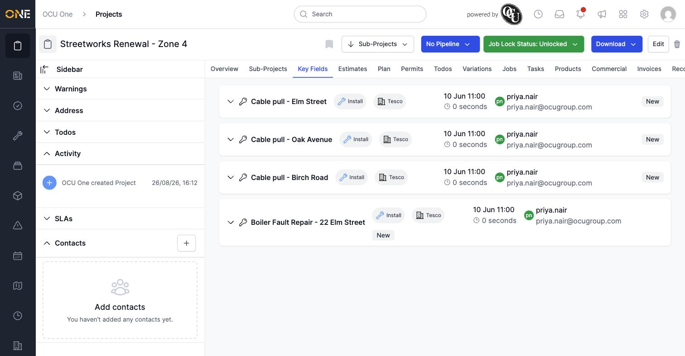
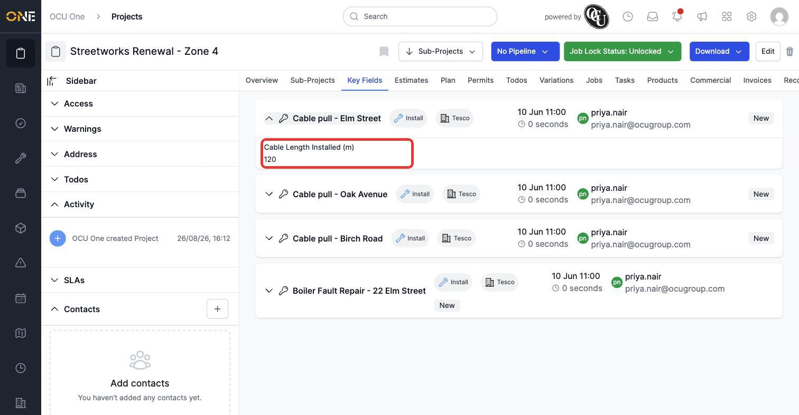

# Viewing key fields rolled up from jobs and tasks

Some fields on a job or task are important enough that you shouldn't have to open every single one to see them. Fields marked as a **Key Field** get pulled together automatically onto the project's **Key Fields** tab, so you can scan the important numbers from every job at once without leaving the project.

## Opening the tab

Open a project and click its **Key Fields** tab (only shown if the project has at least one job or task with a key field on it). Each job appears as a collapsed row with its job type, client, and who created it.

*Every job on the project that has at least one key field, collapsed by default.*

## Viewing a job's key field values

Click the arrow on the left of a job's row to expand it and reveal its key field values.

*Expanding "Cable pull - Elm Street" reveals its "Cable Length Installed (m)" value.*

**Worth knowing:**

- Only fields an admin has specifically marked as a Key Field appear here — most fields on a job never show up on this tab at all.
- A job with no value entered for its key field still appears on this tab; it just shows nothing under the field's name once expanded, rather than being hidden.
- This tab is read-only — to change a value, open the job (or its task) directly and edit the field there.
