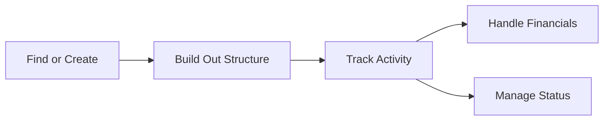

# Projects — Overview

A **Project** is the central record almost everything else in the app hangs off — the jobs, tasks, estimates, invoices, and paperwork for a single piece of work, from a small repair through to a multi-phase civils contract. This is the biggest area in this repo, so this guide groups the individual guides by what they cover rather than listing all of them in one flat line.

## The core pieces

A project has a **Title**, a **Client**, a **Project Type** (which decides which tabs and behaviours it gets), and an auto-generated **Reference**. It can sit under a **Parent Project** as a sub-project, and can have sub-projects of its own — so a large contract can be broken down into smaller, individually-trackable pieces.

Where a project's type is tracked through a lifecycle, it sits on a **Pipeline** and moves through **stages**, the same way a job or ticket does. It can also carry a **RAG status** (Red/Amber/Green) where its type supports it, and jobs on it can be **locked** to stop further booking.

Beyond its own details, a project's work is organised across a row of tabs — which ones appear depends on its type, but commonly include Sub-Projects, Key Fields, Plan, Records, Jobs, Tasks, Estimates, Invoices, Variations, Permits, Todos, and Products/Commercial.

## Why this matters

Treating a piece of work as one project record, with everything else attached to it, is what makes it possible to:

- **See the whole picture in one place** — every job, task, document, and financial record tied to the work is reachable from the project itself, instead of scattered across separate lists.
- **Break large work into manageable pieces** — sub-projects let a big contract be split up while still rolling up to one parent for reporting and client billing.
- **Track commercial reality alongside physical progress** — estimates, invoices, and variations sit right next to the jobs and tasks that generate them.
- **Keep a paper trail** — checklists, records, and permits give a project the documentation and sign-off structure real field work actually needs.

## The end-to-end flow

**Finding and browsing** comes first. Projects can be browsed as a straightforward list — see [Browsing and filtering the projects list](Browsing%20and%20filtering%20the%20projects%20list.md) — as a nested hierarchy via [Browsing projects in drilldown (hierarchy) view](Browsing%20projects%20in%20drilldown%20%28hierarchy%29%20view.md), or on a [Viewing and moving projects on the pipeline (kanban) board](Viewing%20and%20moving%20projects%20on%20the%20pipeline%20%28kanban%29%20board.md) grouped by stage. There's also an attempted [Exploring projects as a relationship graph](Exploring%20projects%20as%20a%20relationship%20graph.md) view — worth knowing before you go looking for it: this one doesn't currently work (see below).

**Creating and managing a project** covers the basics: [Creating a new project](Creating%20a%20new%20project.md), and [Creating a sub-project (child project) under an existing project](Creating%20a%20sub-project%20%28child%20project%29%20under%20an%20existing%20project.md) for breaking work down. Once it exists, [Viewing a project's overview (main tab)](Viewing%20a%20project%27s%20overview%20%28main%20tab%29.md) covers everything that page brings together, [Editing a project's details](Editing%20a%20project%27s%20details.md) covers changing them later, and [Deleting (archiving) a project](Deleting%20%28archiving%29%20a%20project.md) covers removing one for good.

**Structure — children, key fields, and the plan** covers building a project out: [Managing sub-projects on the Children tab](Managing%20sub-projects%20on%20the%20Children%20tab.md) for the sub-projects listed above; [Viewing key fields rolled up from jobs and tasks](Viewing%20key%20fields%20rolled%20up%20from%20jobs%20and%20tasks.md) for a summary view of important field values captured further down; and the Plan tab's checklist system — [Managing the project plan (project groups / checklist tab)](Managing%20the%20project%20plan%20%28project%20groups%20-%20checklist%20tab%29.md) for the groups themselves, [Adding a new checklist item to a project group](Adding%20a%20new%20checklist%20item%20to%20a%20project%20group.md) and [Attaching an existing job or record to a project group checklist](Attaching%20an%20existing%20job%20or%20record%20to%20a%20project%20group%20checklist.md) for getting items onto it two different ways, and [Completing, editing, reordering, and removing checklist items](Completing%2C%20editing%2C%20reordering%2C%20and%20removing%20checklist%20items.md) for working with them afterward.

**Records, jobs, and tasks** is where a project's actual work lives: [Viewing and attaching records (surveys, inspections) to a project](Viewing%20and%20attaching%20records%20%28surveys%2C%20inspections%29%20to%20a%20project.md) covers survey/inspection-style documentation, [Viewing and creating jobs from a project](Viewing%20and%20creating%20jobs%20from%20a%20project.md) covers the booked work itself, and a full set of guides cover Tasks — [Viewing and filtering tasks on a project](Viewing%20and%20filtering%20tasks%20on%20a%20project.md), [Creating a new task under a project](Creating%20a%20new%20task%20under%20a%20project.md), [Viewing and working a task's overview tab](Viewing%20and%20working%20a%20task%27s%20overview%20tab.md), and [Editing or deleting a task](Editing%20or%20deleting%20a%20task.md). Product allocations sit alongside this work too — see [Managing a task's product allocations tab](Managing%20a%20task%27s%20product%20allocations%20tab.md) and [Viewing and managing product allocations on a project](Viewing%20and%20managing%20product%20allocations%20on%20a%20project.md) (part of the wider Planned vs Actual picture — see the overview in [Product Allocations](../Product%20Allocations/_Planned%20vs%20Actual%20-%20Overview.md)).

**Financials — estimates, invoices, variations, permits, and linking** covers the commercial and compliance side: [Viewing and creating estimates on a project](Viewing%20and%20creating%20estimates%20on%20a%20project.md), [Viewing and creating invoices on a project](Viewing%20and%20creating%20invoices%20on%20a%20project.md), and [Viewing and raising variations on a project](Viewing%20and%20raising%20variations%20on%20a%20project.md) cover money in and changes to scope; [Viewing and attaching permits to a project](Viewing%20and%20attaching%20permits%20to%20a%20project.md) covers street-works-style permissions; [Linking related projects together](Linking%20related%20projects%20together.md) covers connecting two projects that aren't in a parent/child relationship. See everything totalled together on [Viewing a project's commercial stats dashboard](Viewing%20an%20projects%20commercial%20stats%20dashboard.md).

**Status — todos, RAG, job locking, and PDF export** rounds out the picture: [Viewing and managing to-dos on a project](Viewing%20and%20managing%20to-dos%20on%20a%20project.md) for small tracked tasks, [Setting a project's RAG status](Setting%20a%20project%27s%20RAG%20status.md) for its health indicator, [Locking and unlocking jobs on a project](Locking%20and%20unlocking%20jobs%20on%20a%20project.md) for pausing work (which auto-unbooks any currently-booked jobs — worth knowing before you click it), and [Downloading or previewing a project PDF](Downloading%20or%20previewing%20a%20project%20PDF.md) for exporting a shareable summary.

## Worth knowing before you start

A couple of things found while writing these guides are worth flagging up front:

- The **relationship graph** ("Explore") view doesn't currently load anything — it stays blank no matter what. See [Exploring projects as a relationship graph](Exploring%20projects%20as%20a%20relationship%20graph.md) for what it's meant to show.
- Changing a project's **RAG status**, or **unlocking** its jobs, can visibly update on screen with no error shown, but the change may not actually save — always refresh the page afterward to confirm a change you made has genuinely stuck, rather than trusting the on-screen label alone.

## The flow at a glance

- **Find or Create** — browse via list, drilldown, or pipeline board, or create a brand new project (or sub-project).
- **Build Out Structure** — add children, key fields, and a Plan checklist.
- **Track Activity** — records, jobs, and tasks accumulate against the project over time.
- **Handle Financials** — estimates, invoices, variations, permits, and links to other projects.
- **Manage Status** — todos, RAG status, job locking, and exporting a PDF summary.

Not every project needs every tab — which ones show up depends on the project's type, and a simple project might only ever use a handful of these. But the full flow above is there for anything with a more involved lifecycle to track.
