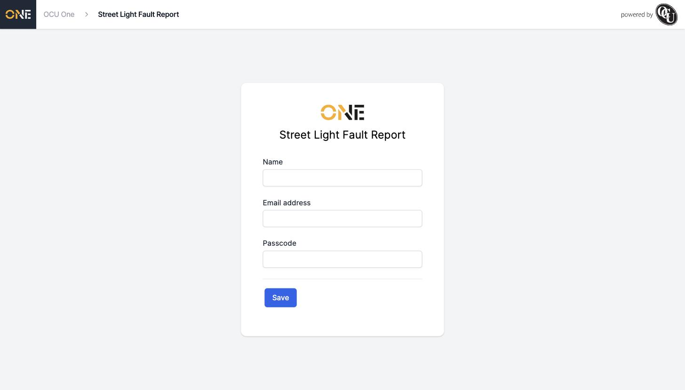
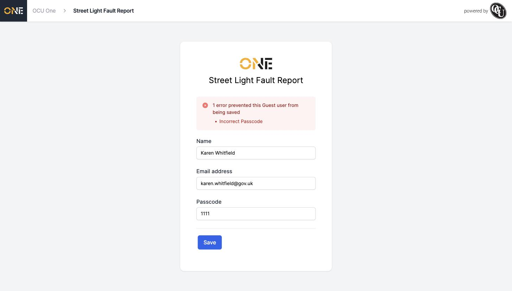

# Accessing a Shared Intake Link and Identifying Yourself

Some Project Types and Record Types let anyone with the right link submit a new Project or Record without needing an OCU One account. Opening one of these links takes you to a short identify form before you can fill anything in.

## Opening the link

Following a public share link (something like `yourdomain.com/share/street-light-fault`) takes you straight to a simple sign-in-free page, branded with the organisation's logo and the name of what you're about to submit:

*The identify form a visitor sees when they first open the link.*

## Filling it in

- **Name** — your name, so whoever picks this up knows who to follow up with.
- **Email address** — your email, used to send you a confirmation once you submit, and to contact you about it later.
- **Passcode** — only shown if the organisation set one up for this link. You'll need to know it in advance (they'd normally share it with you separately from the link itself).

Click **Save** to continue.

## If something's wrong

If the passcode you enter doesn't match, or your email doesn't match a domain the organisation has restricted this link to, you'll see an error banner listing exactly what was wrong, and the form will keep the details you already typed in:

*What you see if the passcode doesn't match.*

Just correct the field the error names and click **Save** again.

## What happens next

Once your details are accepted, you're taken straight into the actual submission form — a new Project or new Record form, depending on what the link was set up for. Your name and email carry over automatically, so you won't need to re-enter them.
