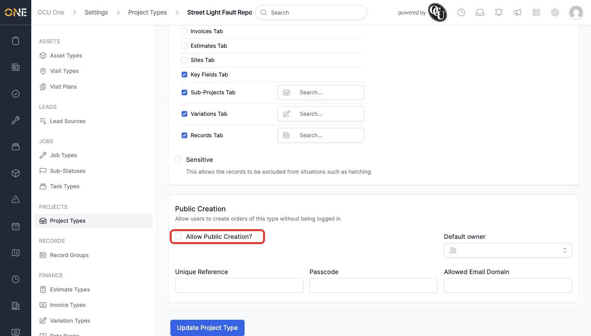
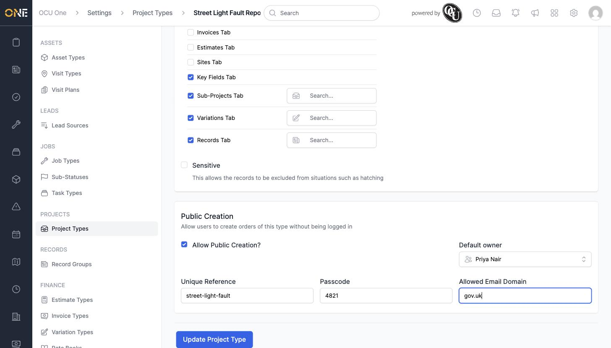
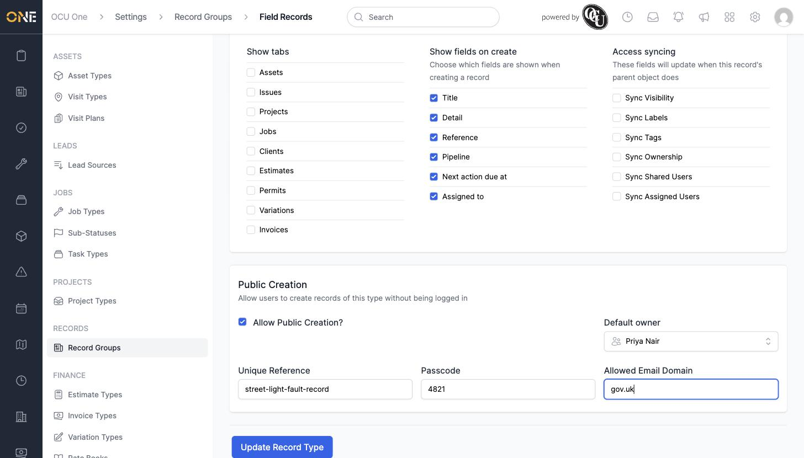

# Enabling a Public Intake Link for a Project Type or Record Type

Project Types and Record Types can each be configured to accept submissions from people who aren't logged into OCU One at all — for example, a member of the public reporting a fault, or a contact filling in a form you've sent them a link to. This is done from the **Public Creation** section on that Project Type's or Record Type's settings page.

## Where to find it

1. Go to **Settings**, then choose **Project Types** (under Projects) or **Record Groups** (under Records), and open the specific type you want to configure.
2. Scroll to the bottom of its settings page to the **Public Creation** card.

By default, **Allow Public Creation?** is unchecked and the rest of the section is empty:

*The Public Creation card before it's been set up.*

## Turning it on

Tick **Allow Public Creation?** to reveal the rest of the settings, then fill in:

- **Default owner** — the person who will own anything created through this public link. This is required once public creation is turned on.
- **Unique Reference** — the last part of the web address people will use to reach this form (for example, `street-light-fault`). It must be unique across the whole system.
- **Passcode** — optional. If set, anyone using the link will need to enter this exact code before they can continue.
- **Allowed Email Domain** — optional. If set, only email addresses ending in this domain (for example, `gov.uk`) will be accepted.

For a Project Type, a **Default client lead** must also be set elsewhere on the page before you can save — public creation won't save without one.

*Public Creation fully configured for a Project Type.*

Click **Update Project Type** (or **Update Record Type**) to save. Once saved, anyone with the reference — `yourdomain.com/share?reference=street-light-fault` — can reach the public intake form.

## Record Types work the same way

A Record Type's settings page has an identical **Public Creation** card near the bottom, with the same **Allow Public Creation?**, **Default owner**, **Unique Reference**, **Passcode**, and **Allowed Email Domain** fields (Record Types don't have a client lead requirement):

*Public Creation configured for a Record Type.*

## A note on the passcode and email domain

- If you set a passcode, make sure to share it separately from the link itself (for example, in a follow-up email or over the phone) — otherwise it doesn't add any real protection.
- The allowed email domain check only looks at what comes after the `@`, so `gov.uk` would accept any address ending in `gov.uk`, not just an exact organisation's domain.
