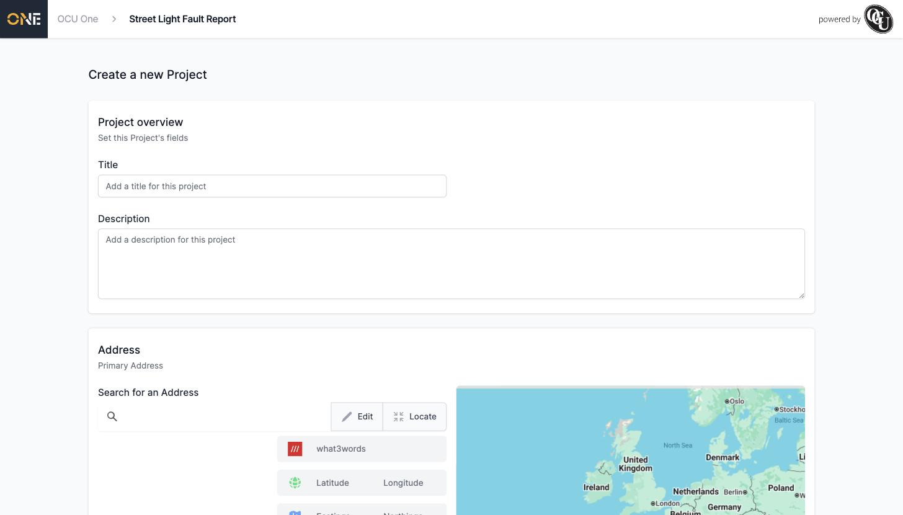
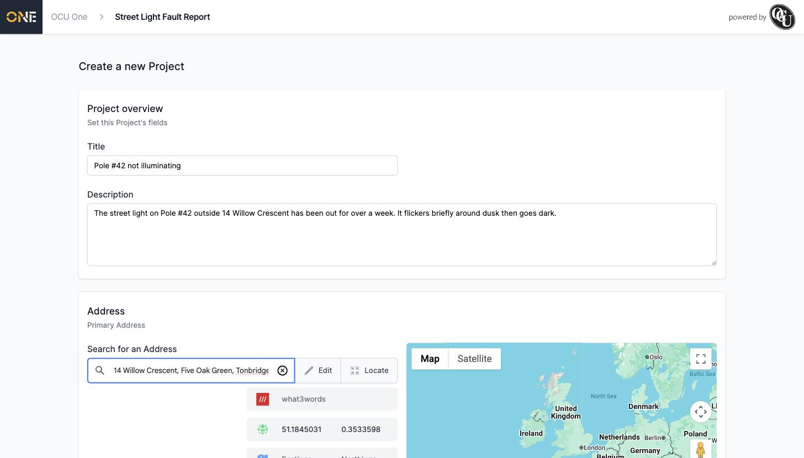
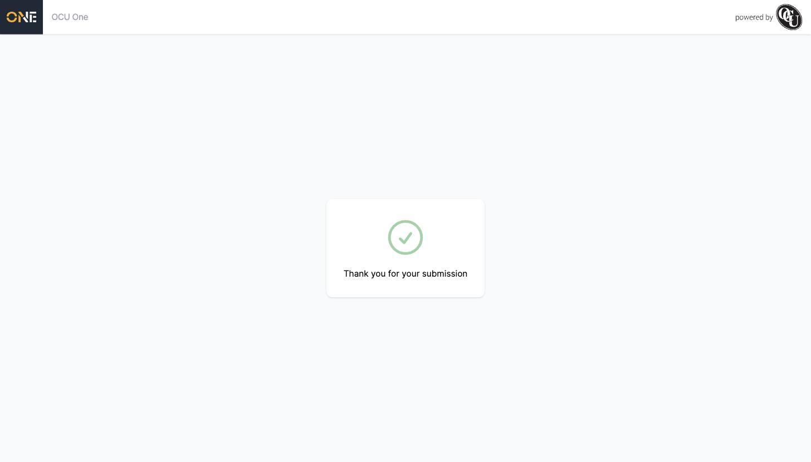

# Submitting a New Project Through a Public Share Link

Once you've identified yourself on a public share link (see [Accessing a Shared Intake Link and Identifying Yourself](Accessing%20a%20Shared%20Intake%20Link%20and%20Identifying%20Yourself.md)), you land on a form to actually submit your new Project.

## Filling in the Project

The exact fields you'll see depend on how the organisation has set this Project Type up, but a **Title** and **Description** are typical:

*The top of the form — give it a short, clear title and describe what's wrong.*

- **Title** — a short summary. This is what staff will see first, so be specific (for example, "Pole #42 not illuminating" rather than just "Broken light").
- **Description** — the detail: where exactly, how long it's been happening, anything else worth knowing.

## Adding an address

If the Project Type includes a location, use **Search for an Address** and start typing — pick the matching result from the list that appears. This fills in the address, coordinates, and map pin automatically:

*Search for an address rather than typing coordinates by hand.*

You can also use **Edit** to type an address manually, or **Locate** to use your device's current location instead.

## Submitting

Once everything's filled in, click **Create Project** at the bottom of the form. You'll see a confirmation screen:

*What you see immediately after submitting.*

You'll also receive a confirmation email at the address you gave earlier. From here, the Project goes to whoever the organisation set as the default owner for this Project Type, the same as if it had been created by a staff member.
