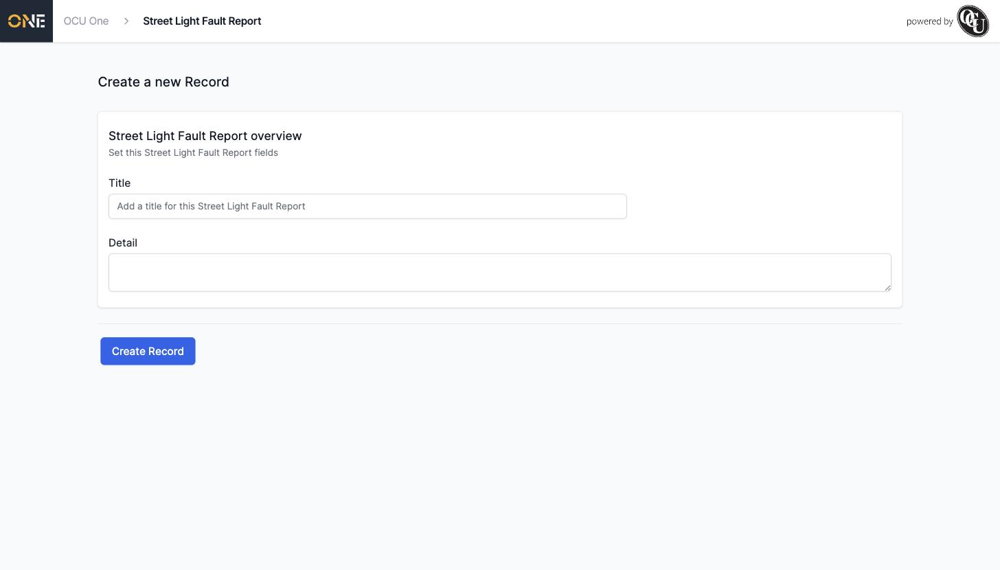
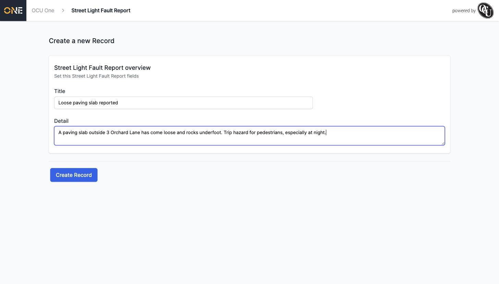
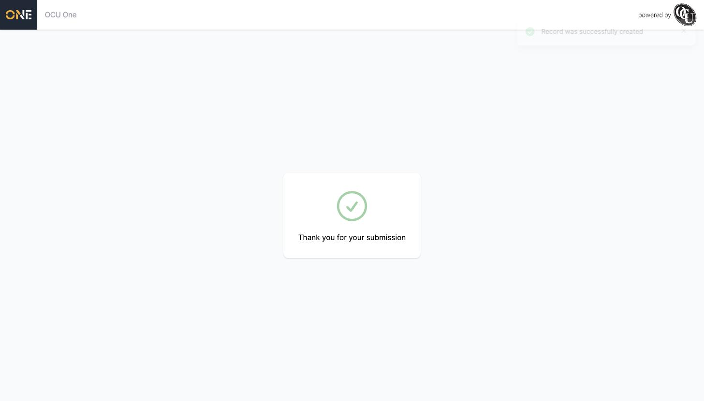

# Submitting a New Record Through a Public Share Link

Record Types can be shared publicly the same way Project Types can. After identifying yourself on the share link (see [Accessing a Shared Intake Link and Identifying Yourself](Accessing%20a%20Shared%20Intake%20Link%20and%20Identifying%20Yourself.md)), you're taken to a form to submit the new Record.

## Filling in the Record

The form is headed with the name of the Record Type itself, and lists whatever fields the organisation has chosen to show on public submissions — typically at least a **Title** and **Detail**:

*The blank form — its fields depend on how this Record Type has been configured.*

- **Title** — a short summary of what you're reporting.
- **Detail** — the specifics: exact location, what you've noticed, and anything else that would help.

*A filled-in example — Records don't have an address section by default, unlike Projects.*

## Submitting

Click **Create Record** to send it in. You'll land on a confirmation screen just like the Project version:

*What you see immediately after submitting.*

As with a publicly submitted Project, the Record is assigned to whoever the organisation set as the default owner for this Record Type, and you'll get a confirmation email at the address you gave when you identified yourself.
