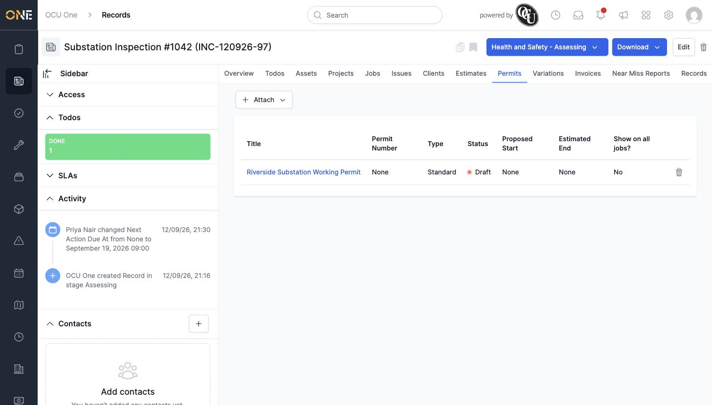

# Attaching and detaching a permit on a record

A record can have one permit attached, drawn from the permits already active on a project the record is linked to.

## Getting there

Open the record and click its **Permits** tab.

## Attaching a permit

Click **Attach**, then **Existing**. A search box appears — leave it empty to browse every eligible permit, since typing part of the permit's title can miss a match if the permit hasn't been assigned a reference number yet:

Select the permit and click the link icon to confirm. It appears in the tab with its Permit Number, Type, Status, and dates:

## Detaching a permit

Click the trash-can icon next to the attached permit's row, then confirm "Are you sure you want to detach this?". The tab returns to empty, and the permit itself is unaffected — only the link to this record is removed.

## Things to know

- A record can only have one permit attached at a time.
- If a search for the permit by name returns nothing, clear the search box completely rather than assuming the permit isn't eligible.
