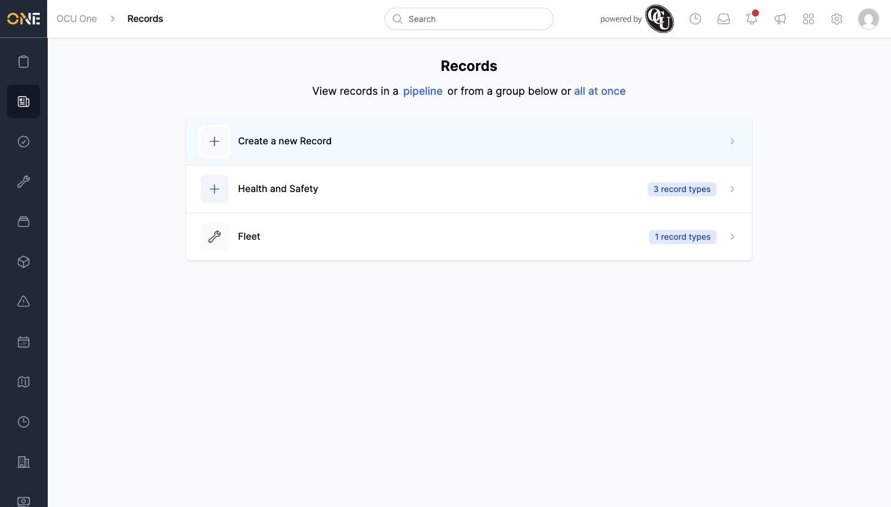

# Browsing all record type categories (Record Groups landing page)

The Records landing page is where you start whenever you want to view or create a record — it's your entry point into every type of form, check, or report your organisation keeps.

## Getting there

Click the Records icon in the left-hand sidebar.

## What's on this page

At the top of the page:
- **Create a new Record** — jumps straight into picking a record type and filling in a new record.
- A link to view records **in a pipeline** (a Kanban-style board), or **all at once** in one combined list across every group.

Below that, each row is a **Record Group** — a category your record types are organised under — showing how many record types it contains. Click a group's row to see the record types inside it.

## Things to know

- You only see the groups and record types you actually have permission to work with — a group with no accessible record types simply won't appear here at all.
