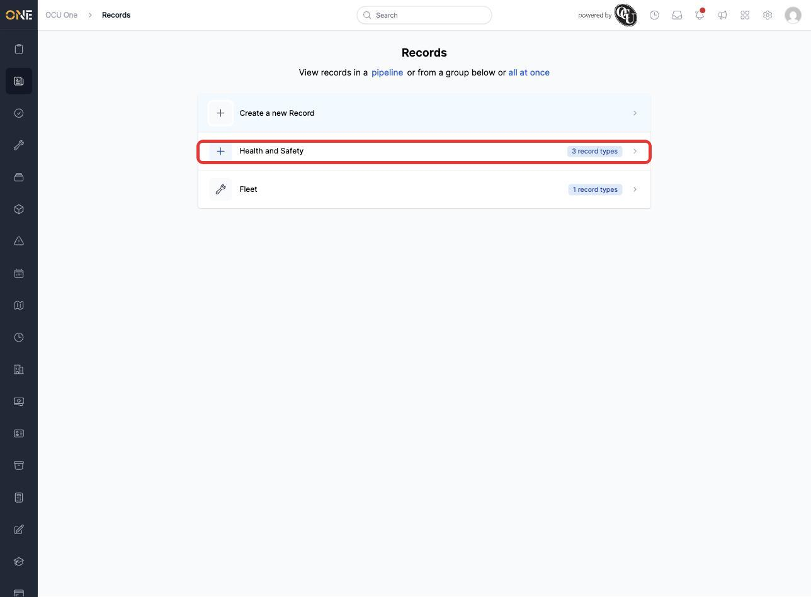
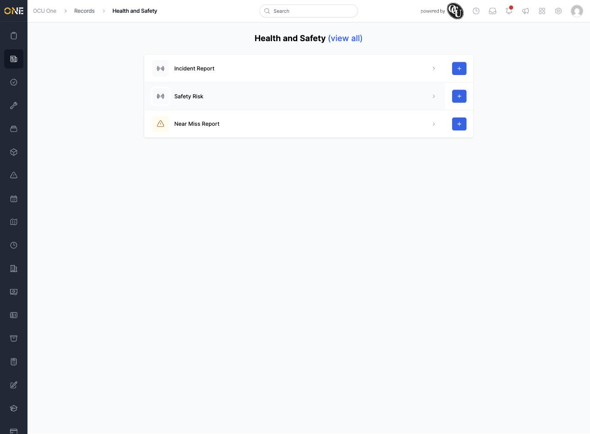

# Browsing records by category (Record Groups hub)

Records cover the wide range of forms, checks, and reports your organisation keeps — from safety inspections to vehicle checks. Rather than searching through every record type at once, the Records hub groups them into categories, so you can browse by the area you actually work in.

## Getting there

Click the Records icon in the left-hand sidebar.

## What's on this page

The hub lists **Record Groups** — the categories your record types are organised under, each showing how many record types it contains:

Click a group to see the record types inside it:

From here you can:
- Click a record type's row to open its list of records.
- Click the **+** button next to a record type to create a new record of that type directly.

## Things to know

- Only record types you have permission to create show a **+** button, and only groups containing at least one record type you can access appear on the hub at all.
- Click **(view all)** at the top of a group's page, or **all at once** on the main hub, to see every record type across every group in one place instead of browsing category by category.
- If you already know which specific record type or pipeline you want, the **pipeline** link at the top of the hub jumps straight to a Kanban-style board view instead.
