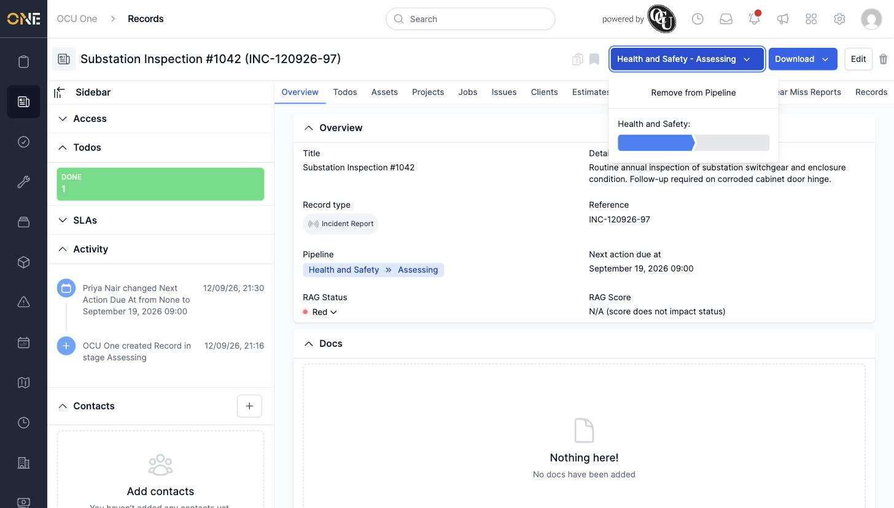
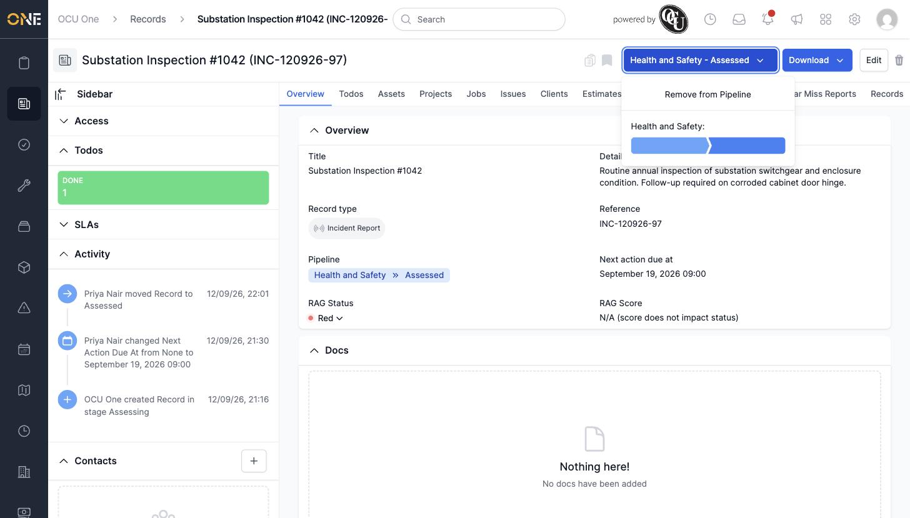

# Changing and reordering a record's pipeline stage

## Getting there

Open the record's **Overview** tab, and click the pipeline button in the top-right corner (labelled with the pipeline's name and current stage, e.g. "Health and Safety - Assessing").

## Moving to a new stage

A progress bar shows the pipeline's stages — the filled portion marks the current stage:

Click further along the bar, into the next stage's segment, to move the record there:

## Things to know

- **Remove from Pipeline** in the same dropdown takes the record off the pipeline entirely.
- Every stage change is logged in the **Activity** panel, along with who made it.
