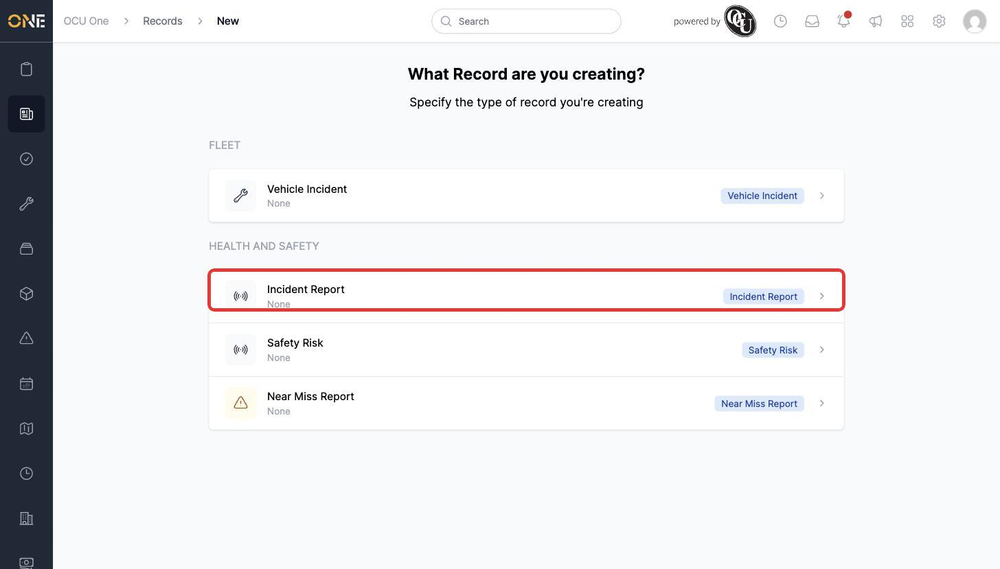

# Choosing a record type before creating a new record

Before you can fill in a new record, you first pick which type of record you're creating — this decides which fields, and which group, it belongs to.

## Getting there

Click **Create a new Record** on the Records landing page (or **+** next to a record type on a group's page, which skips this step).

## What's on this page

Record types are listed grouped under their Record Group heading:

Click a record type's row to move on to the actual creation form for that type.

## Things to know

- You'll only see the record types (and groups) you have permission to create a record for.
