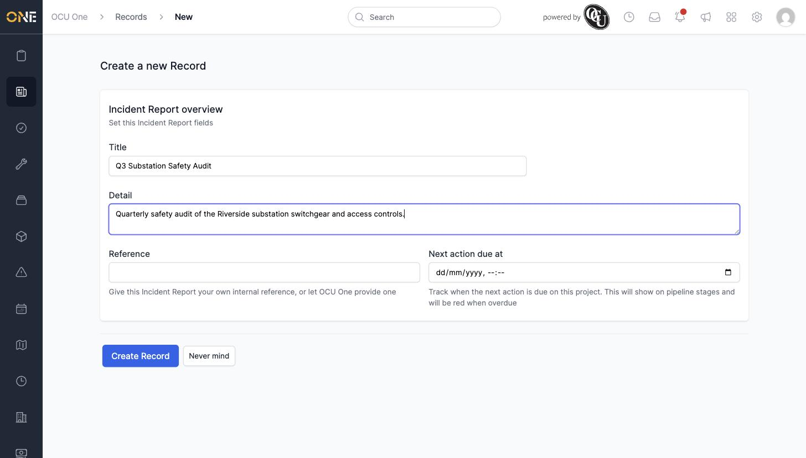
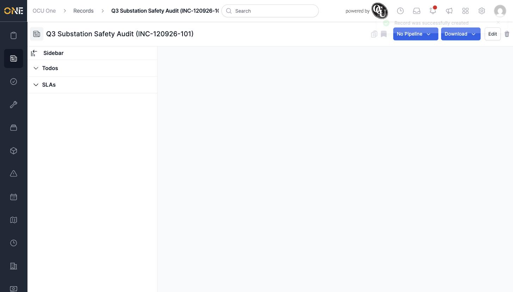

# Creating a new record

## Getting there

Click **Create a new Record** on the Records landing page, then pick a record type. (Or click **+** next to a record type on a group's page, which takes you straight here.)

## Filling in the form

- **Title** — a short name for the record.
- **Detail** — a free-text description.
- **Reference** — leave blank to have OCU One generate one automatically, or set your own.
- **Next action due at** — an optional date/time; it'll show on pipeline stages and turn red if it passes.

Click **Create Record** to save it.

## Things to know

- What other fields appear on this form (and whether there's a pipeline to place the new record on right away) depends on how the record type has been configured — some types show far more than Title/Detail/Reference.
