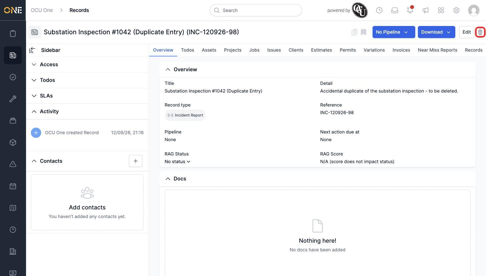
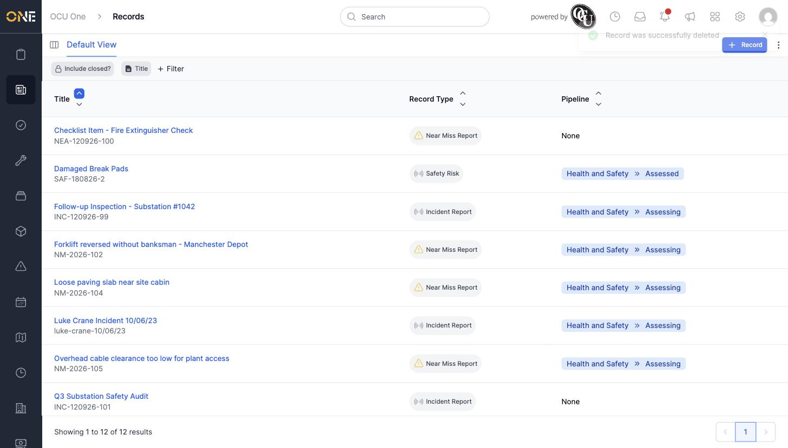

# Deleting (archiving) a record

Deleting a record doesn't destroy it outright — it archives it, so it disappears from lists and searches without permanently losing the data.

## Getting there

Open the record you want to remove, and click the trash-can icon in the top-right corner.

## What happens

A confirmation dialog asks "Are you sure you want to delete this?" before anything happens. Confirm it, and you're taken back to the Records list, which no longer shows the deleted record:

## Things to know

- This is a soft delete — the record's data isn't lost, it's just archived and hidden from normal views.
