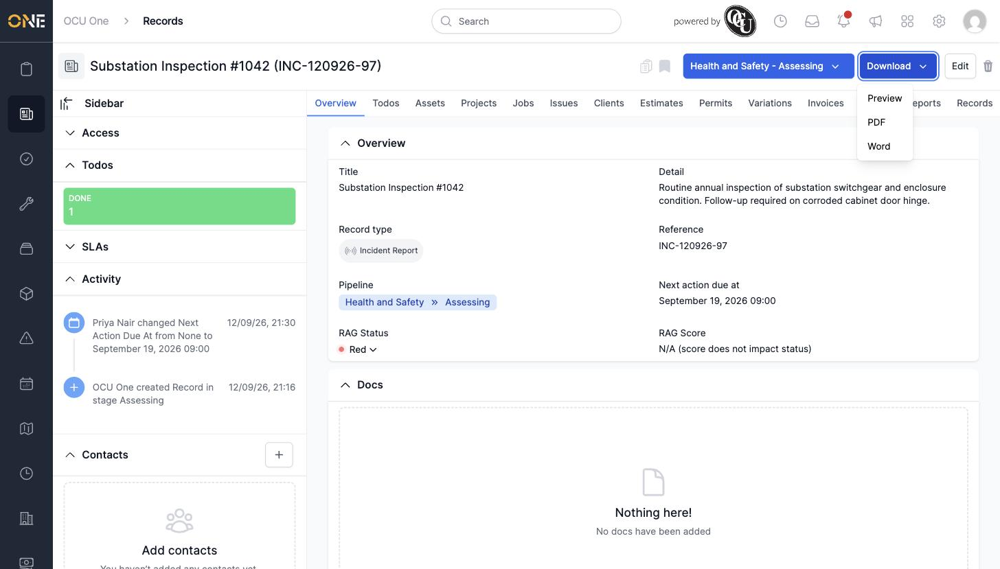
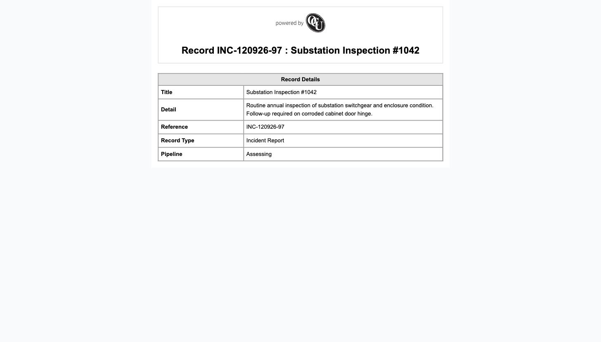

# Downloading a record as PDF or Word document

## Getting there

Open the record and click **Download** in the top-right corner.

## What's on the menu

- **Preview** — opens a photo-selection screen first (choose which images to include, or pick green to show everything), then renders the document in the browser without downloading a file.
- **PDF** — downloads the record as a PDF, after the same photo-selection step.
- **Word** — downloads the record as a Word (.docx) document.

## Things to know

- Which fields and layout appear on the PDF/Word export depends on the record type — some record types use a custom template instead of the default layout shown here.
