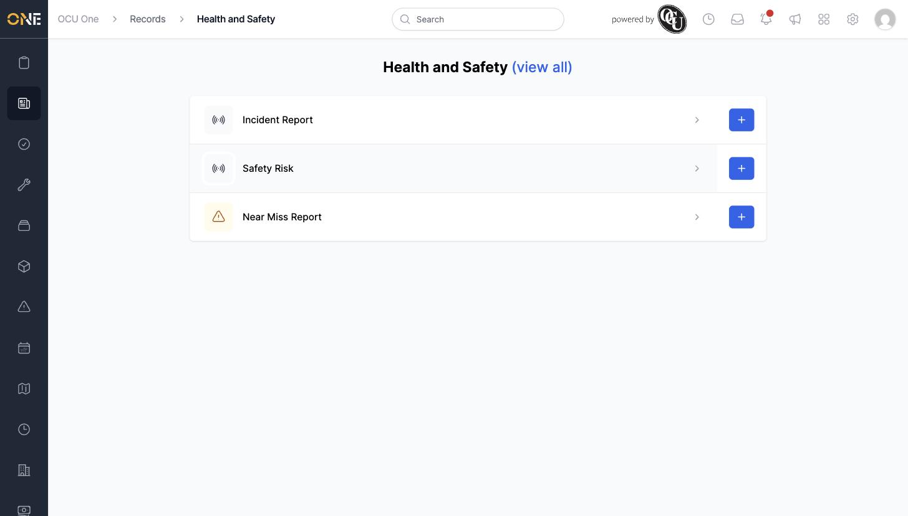

# Drilling into a Record Group to pick a record type

Once you're on the Records landing page, clicking a group takes you one level down to the actual record types you can work with.

## Getting there

From the Records landing page, click a group's row (for example "Health and Safety").

## What's on this page

Each row is a record type that belongs to this group. From here you can:
- Click a record type's row to open its list of existing records.
- Click the **+** button next to a record type to create a new record of that type directly, skipping the type-picker step.

## Things to know

- **(view all)** next to the group's name at the top switches to a combined list of every record across all of that group's types, instead of browsing type by type.
- Only record types you have permission to create show a **+** button.
