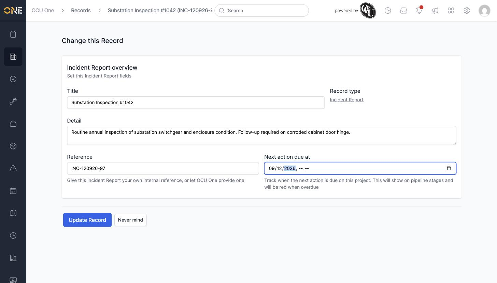
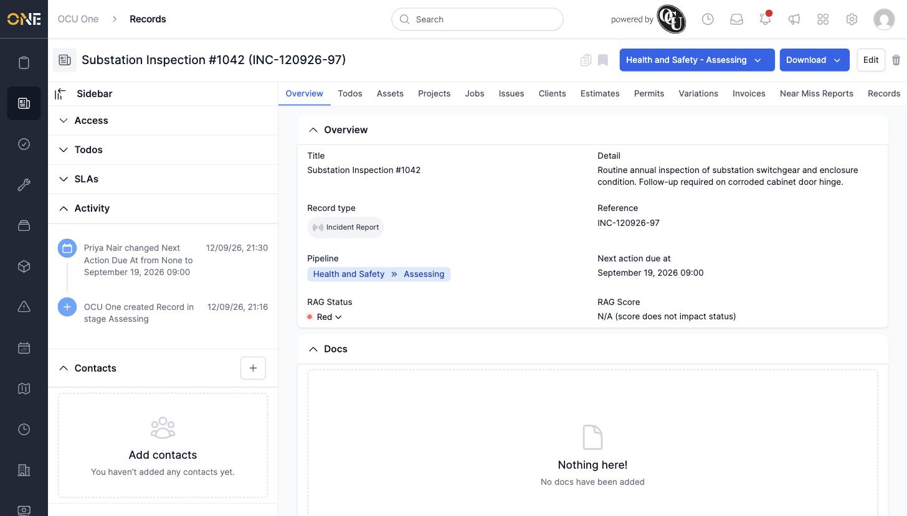

# Editing a record's details

## Getting there

Open the record, then click **Edit** in the top-right corner.

## Making changes

The edit form has the same fields as when the record was created — Title, Detail, Reference, and Next action due at:

Click **Update Record** to save.

## Things to know

- **Next action due at** must be set to a date and time in the future — the form will reject a date in the past.
- Every change is logged in the **Activity** panel in the sidebar, along with who made it.
