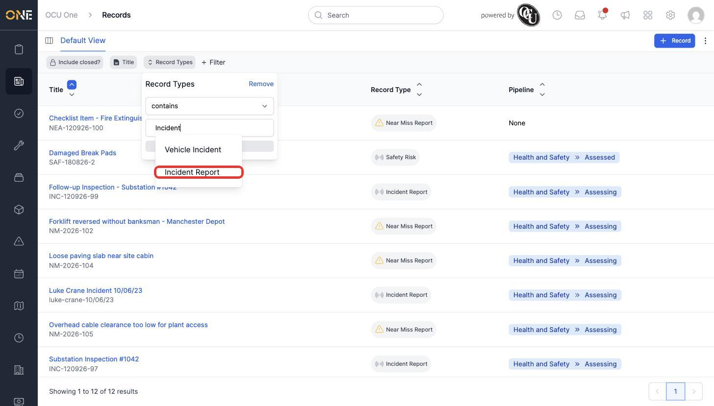
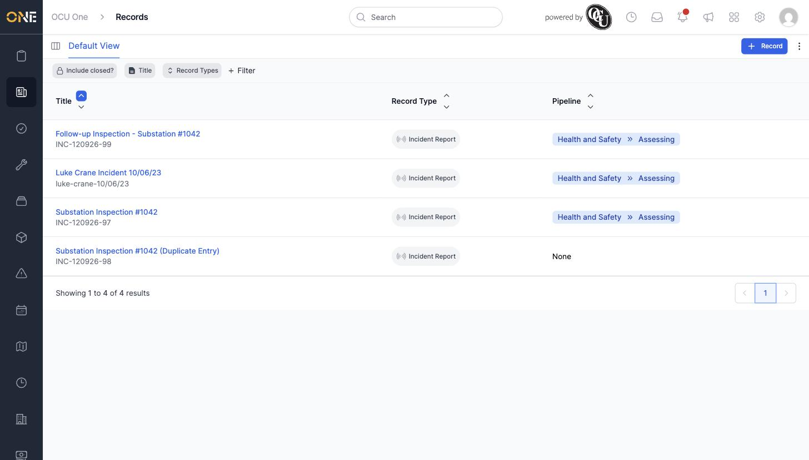

# Filtering and searching records in the list view

The combined Records table can list a lot of records at once. Filters let you narrow it down to just the ones you care about.

## Getting there

From the Records table view, click **+ Filter**.

## Adding a filter

The filter menu lists everything you can filter by — Title, Detail, Reference, Created at, Record Types, Record Groups, Pipelines, Stages, Owner, Assigned users, and more. Choosing one adds it as a chip next to **+ Filter**.

Click **Record Types** to add a filter for record type, then click the new chip to set its value:

Pick **Incident Report** and click **Update** to apply it:

## Things to know

- Each filter chip has its own condition (e.g. "contains") and a search box for the value — click the chip again any time to change it.
- Click a filter chip and then **Remove** to take that filter off again.
- Filters combine — add more than one chip to narrow the list down further.
