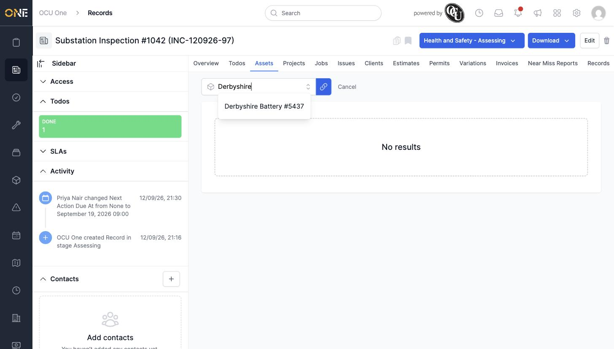
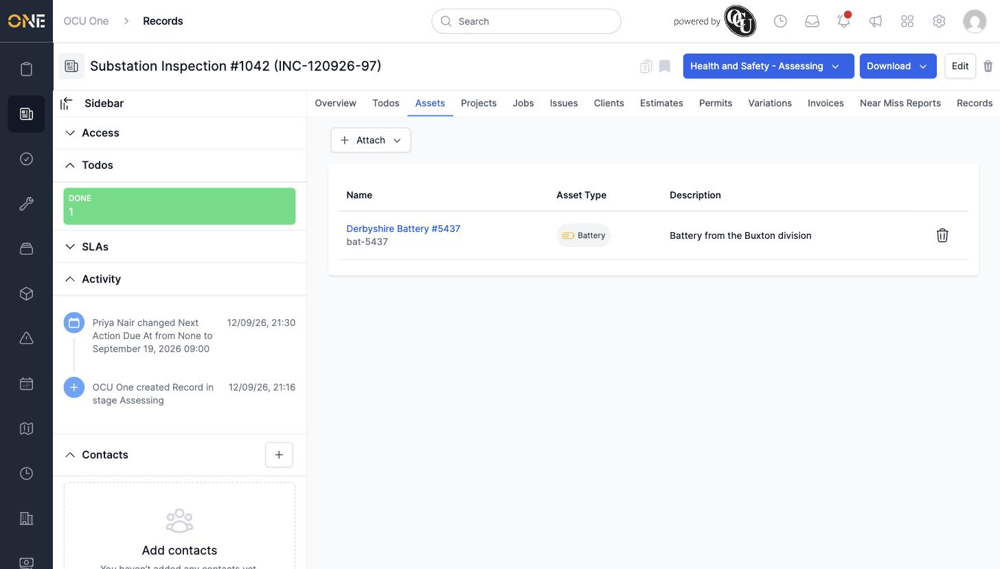

# Managing assets linked to a record

## Getting there

Open the record and click its **Assets** tab.

## Attaching an existing asset

Click **Attach**, then search for the asset by name:

Select it from the list, then click the link icon next to the search box to confirm. The asset now appears in the tab's table, showing its name, asset type, and description:

## Things to know

- Click the trash-can icon next to an attached asset's row to remove the link (the asset itself isn't deleted).
- This tab only shows assets already in the system — there's no option to create a brand-new asset from here.
