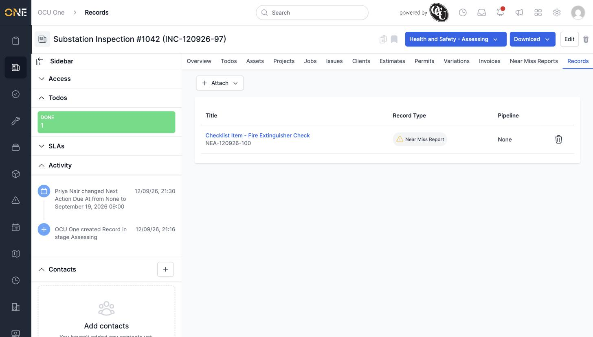

# Managing child records of a specific type ("Records" tab)

When a record type is set up to allow another type as a "child" (for example, letting an Incident Report collect its own Near Miss Reports), a dedicated tab appears named after that child type.

## Getting there

Open the record and click the tab named after the child record type — in this example, **Near Miss Reports**. (A generic **Records** tab, showing children of any attachable type together, is also available.)

## Attaching a child record

Click **Attach**, then **Existing**, and search for a record of that type by title:

## Things to know

- **Attach → New** is also available, to create a brand-new record of that child type already attached.
- Which child-type tabs appear at all depends on how the record type has been configured in Settings — not every record type has one.
- Click the trash-can icon next to a row to remove the link (the child record itself isn't deleted).
