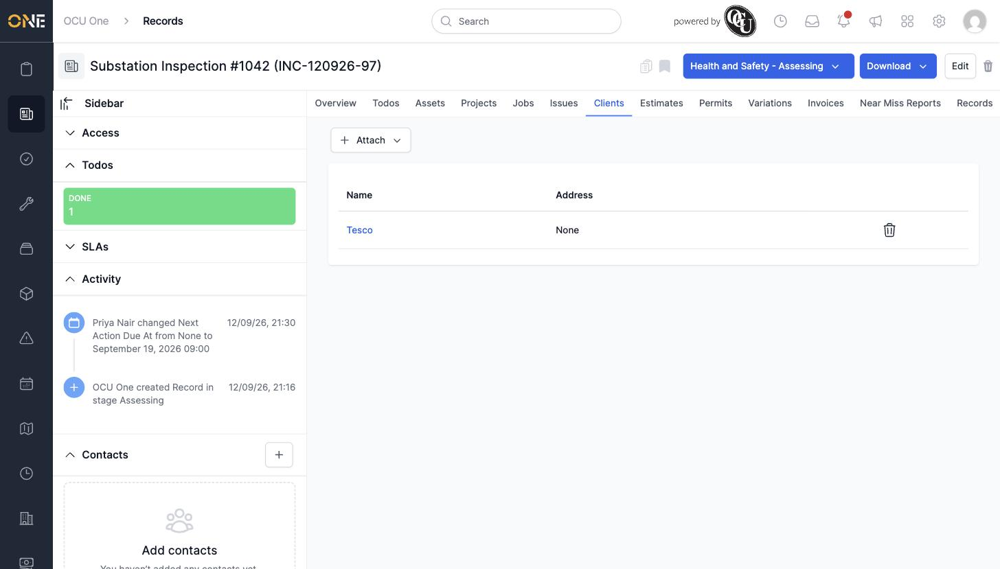

# Managing clients linked to a record

## Getting there

Open the record and click its **Clients** tab.

## Attaching an existing client

Click **Attach**, then **Existing**, and search for the client by name. Pick the existing client from the suggestions (not "Add '...' as a new client", which creates a brand-new one) and confirm:

## Things to know

- **Attach → New** is also available if you genuinely want to create a new client from the record.
- Click the trash-can icon next to an attached client's row to remove the link (the client itself isn't deleted).
