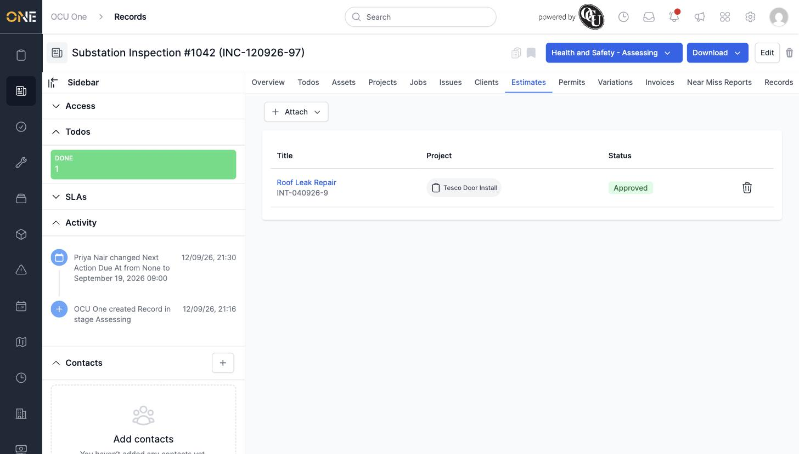

# Managing estimates linked to a record

## Getting there

Open the record and click its **Estimates** tab.

## Attaching an existing estimate

Click **Attach**, then **Existing**, and pick the estimate from the list (or search by name):

## Things to know

- **Attach → New** is also available if you want to create a brand-new estimate directly from the record instead of linking an existing one.
- Click the trash-can icon next to an attached estimate's row to remove the link.
