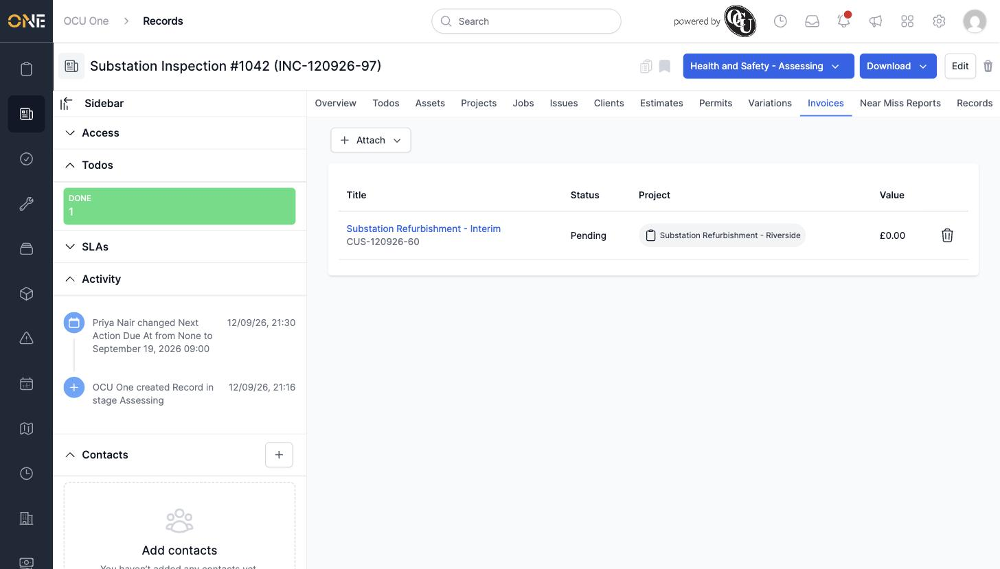

# Managing invoices linked to a record

## Getting there

Open the record and click its **Invoices** tab.

## Attaching an existing invoice

Click **Attach**, then search — the picker offers an **On attached projects** quick option to narrow the list to invoices on projects the record is already attached to, or you can search by name. Select one and confirm:

## Things to know

- This tab only attaches invoices that already exist — there's no option to create a new one from here.
- Click the trash-can icon next to an invoice's row to remove the link (the invoice itself isn't deleted).
