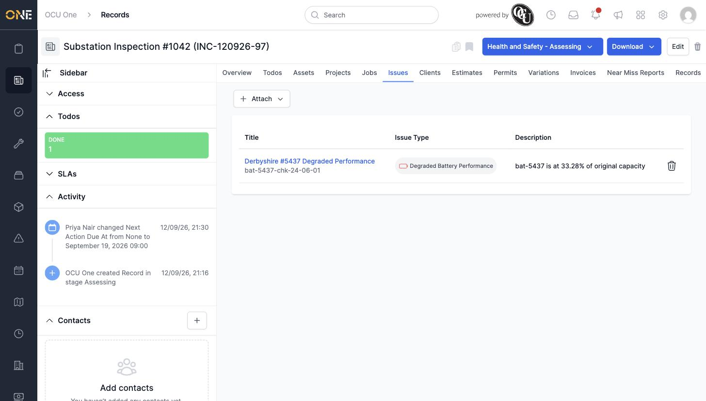

# Managing issues linked to a record

## Getting there

Open the record and click its **Issues** tab.

## Attaching an existing issue

Click **Attach**, then search for the issue by name and select it, then click the link icon to confirm:

## Things to know

- This tab only attaches issues that already exist — there's no option to raise a brand-new issue from here.
- Click the trash-can icon next to an attached issue to remove the link (the issue itself isn't deleted).
