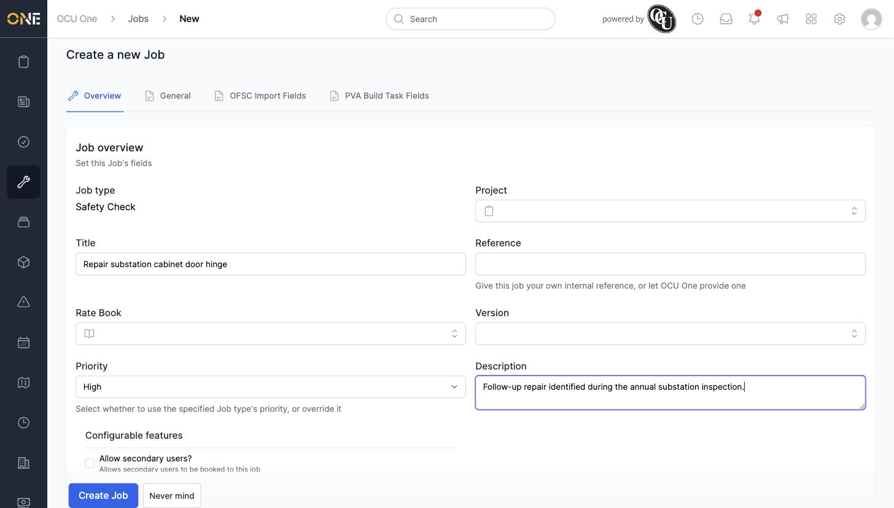
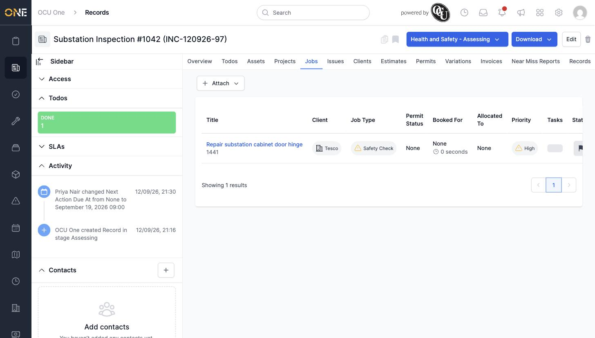

# Managing jobs linked to a record

## Getting there

Open the record and click its **Jobs** tab.

## Creating a new job from the record

Click **Attach**, then **New**, and pick a job type. The job creation form opens with **Project** and **Description** ready to fill in, alongside a **Client** field further down the page:

Scroll down to the **Client & User** section and search for the client by name — pick the existing client from the suggestions (not the "Add as a new client" option, which is for genuinely new clients only). Click **Create Job**, and the new job appears in the Jobs tab:

## Attaching an existing job

Click **Attach**, then **Existing**, and search for the job by title to link one that already exists instead of creating a new one.

## Things to know

- A job's **Client** field must be filled in with an existing client from the picker's suggestions — always click the exact existing option, not "Add '...' as a new client", even if the name looks identical.
