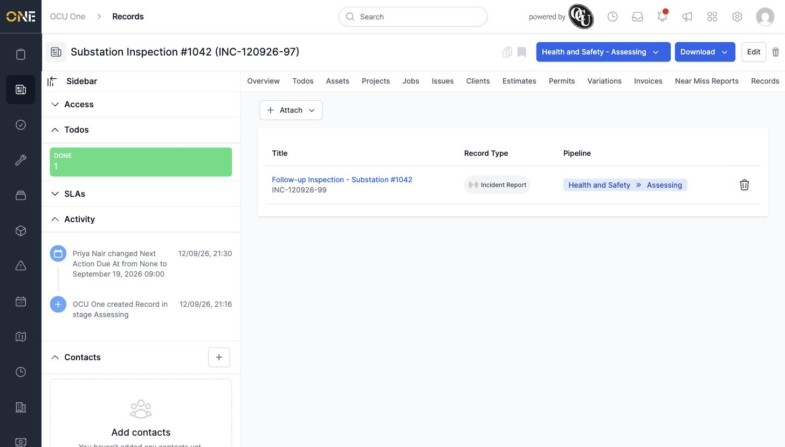

# Managing linked records (record-to-record relationships)

Records can link to other records directly — for example, connecting a follow-up inspection back to the original one it followed up on.

## Getting there

Open the record and click its **Linked to me** tab (scroll the tab bar right if it's off-screen — it's the last tab).

## Attaching a linked record

Click **Attach**, then **Existing**, and search for the other record by title:

## Things to know

- **Attach → New** is also available, letting you create a brand-new record already linked to this one.
- Click the trash-can icon next to a linked record's row to remove the link (the other record itself isn't deleted).
- This is different from the per-type "child record" tabs (see [Managing child records of a specific type ("Records" tab)](Managing%20child%20records%20of%20a%20specific%20type%20%28Records%20tab%29.md)) — this tab links any record to any other record regardless of type.
