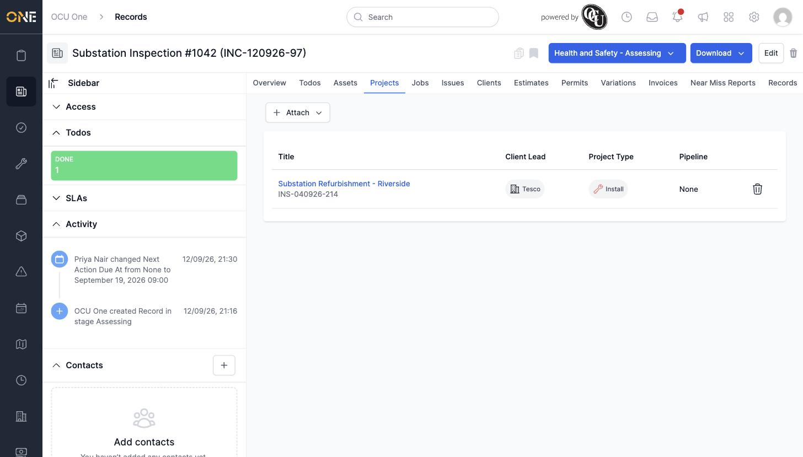

# Managing projects linked to a record

## Getting there

Open the record and click its **Projects** tab.

## What's on this page

Attached projects are listed with their Client Lead, Project Type, and Pipeline stage:

Click **Attach** to link another existing project, searching by name.

## Things to know

- Click the trash-can icon next to a project's row to remove the link (the project itself isn't deleted).
- A record can be attached to more than one project at once.
