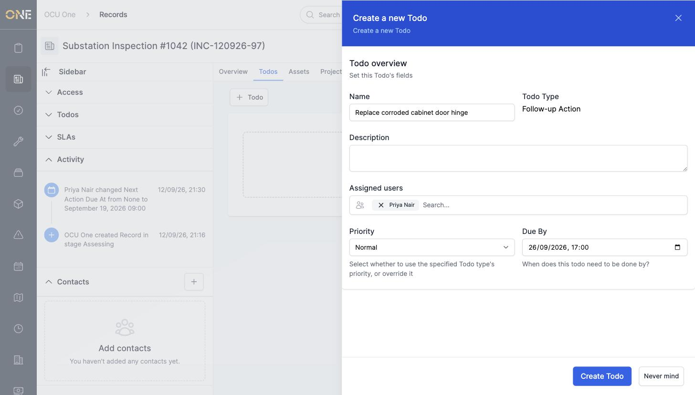
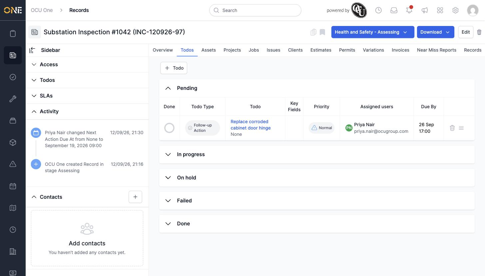
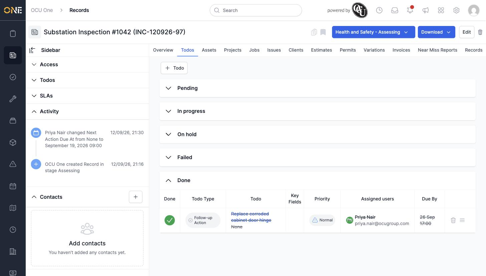

# Managing todos on a record

Todos let you track follow-up actions against a specific record, so nothing agreed during an inspection or review gets forgotten.

## Getting there

Open the record and click its **Todos** tab.

## Adding a todo

Click **+ Todo**, pick a todo type if more than one is available, then fill in the details:

Click **Create Todo** to save it. It appears under its status column — **Pending**, **In progress**, **On hold**, **Failed**, or **Done**:

## Marking a todo done

Click the circle in the **Done** column next to a todo to mark it complete. It moves into the **Done** section with its text struck through:

## Things to know

- The Todos tab also shows a live count badge in the sidebar (e.g. "DONE 1") so you can see progress without opening the tab.
- Which todo types are available to pick from here depends on what's been set up for your tenant — if only one type is available, it's applied automatically without asking.
