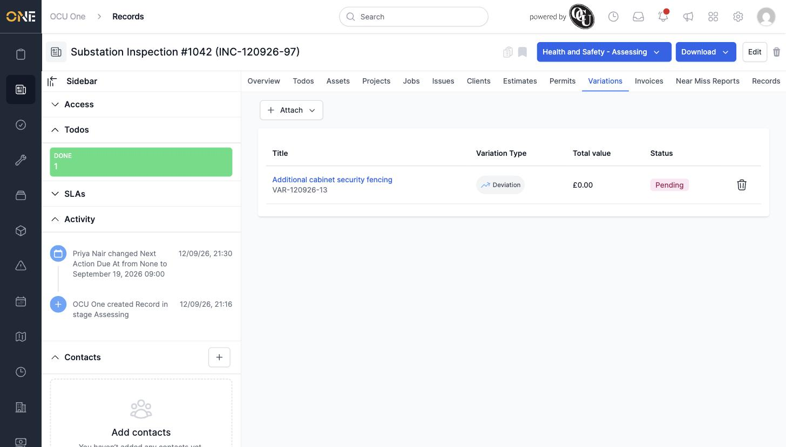

# Managing variations linked to a record

## Getting there

Open the record and click its **Variations** tab.

## Attaching an existing variation

Click **Attach**, then search — the picker offers an **On attached projects** quick option to narrow the list to variations on projects the record is already attached to, or you can search by name across all eligible variations. Select one and confirm:

## Things to know

- This tab only attaches variations that already exist — there's no option to raise a new one from here.
- Click the trash-can icon next to a variation's row to remove the link (the variation itself isn't deleted).
