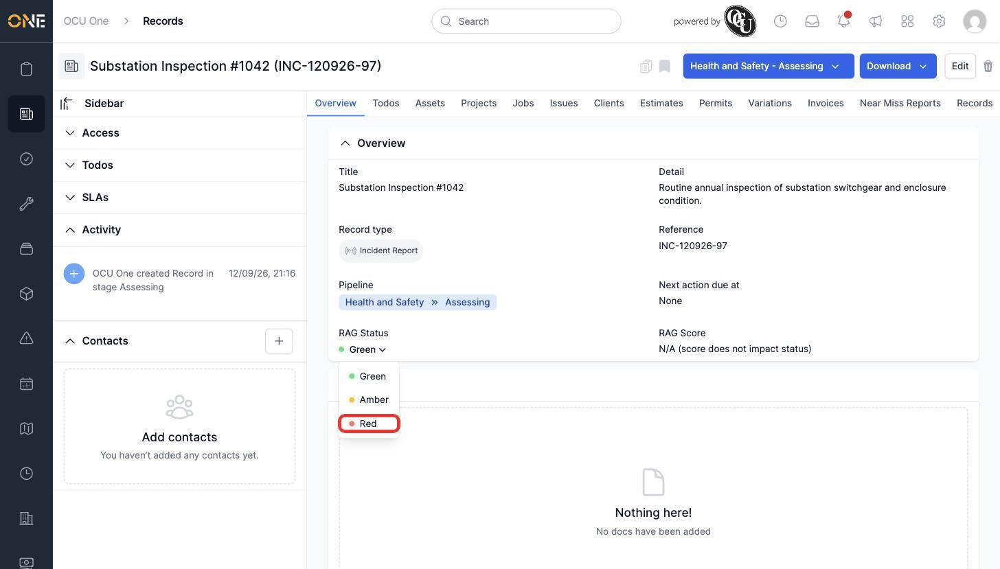
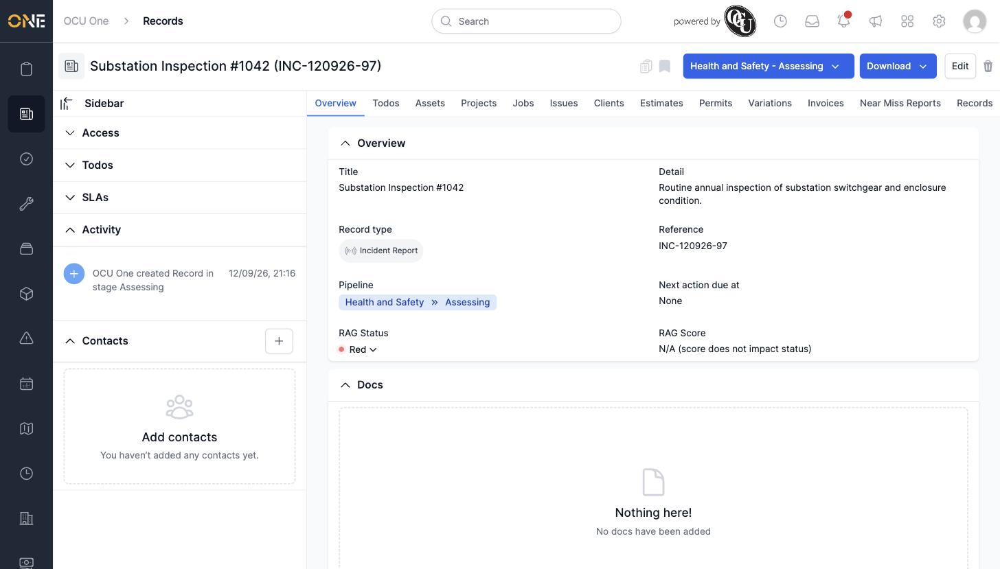

# Setting a record's RAG status

For record types set up to track health, a RAG (Red/Amber/Green) status gives an at-a-glance sense of how things stand — like a traffic light.

## Getting there

Open the record's **Overview** tab. If the record type tracks RAG, you'll see a **RAG Status** field with a coloured dot and a dropdown arrow.

## Changing it

Click the RAG Status value to open the dropdown:

Pick a colour, and it updates immediately:

## Things to know

- RAG Status only appears on record types that have been configured to use it — not every record type shows this field.
- **RAG Score** is separate, and only affects the status on record types set up to calculate it automatically from other fields; otherwise it just reads "N/A (score does not impact status)".
