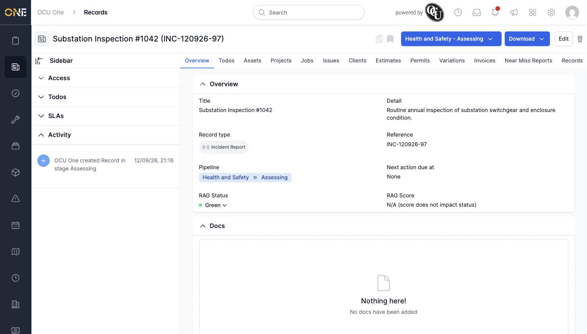

# Viewing a record's Overview/Main tab

The Overview tab is a record's home page — the first thing you see when you open it, showing its core details at a glance.

## Getting there

Open any record (from a list, a group, or search) and stay on its **Overview** tab.

## What's on this page

- **Title**, **Detail**, **Record type**, and **Reference** — the record's core identity.
- **Pipeline** — its current stage, if the record type uses one.
- **Next action due at** — when set, this is the date shown on pipeline stages.
- **RAG Status** and **RAG Score** — only shown for record types configured to track a RAG (Red/Amber/Green) status. See [Setting a record's RAG status](Setting%20a%20record%27s%20RAG%20status.md).

Below the fields, a **Docs** section lists any documents attached directly to the record.

The left-hand sidebar (Access, Todos, SLAs, Activity, Contacts) stays visible across every tab, not just Overview.

## Things to know

- Which fields actually appear here depends on how the record type has been set up — some record types show extra custom fields alongside these.
