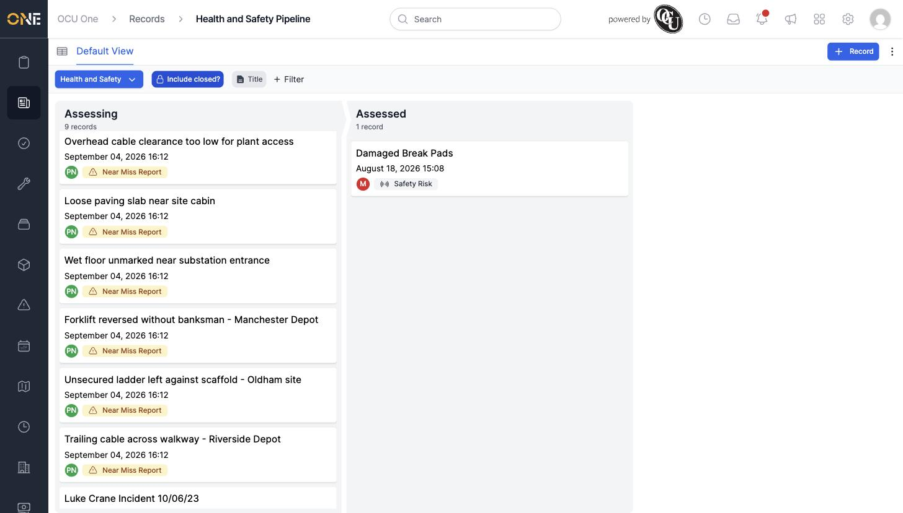

# Viewing and filtering the Records pipeline/kanban board

Records on a pipeline can also be viewed as a Kanban-style board, with one column per stage, instead of a flat list.

## Getting there

From the Records landing page, click **pipeline**. Or, from the Records table view, click the view-switcher icon next to "Default View" to toggle from the table into the board.

## What's on this page

Each column is a pipeline stage, with a running count of how many records are in it. Each card shows the record's title, when it was last updated, its owner (as a coloured initial), and its record type.

## Things to know

- **Include closed?** and **+ Filter** above the board work the same way as on the table view, letting you narrow down which records show up on the board.
- If your tenant has more than one pipeline, use the pipeline-name dropdown at the top-left to switch between them.
