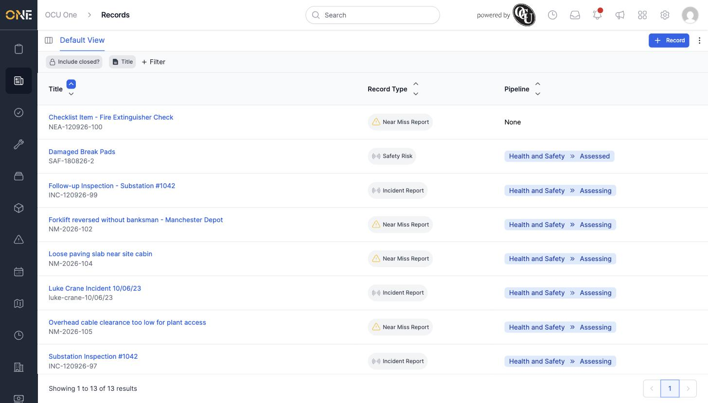

# Viewing the Records list (table view)

Every record across every type you have access to also lives in one combined table view, rather than always having to browse group by group.

## Getting there

From the Records landing page, click **all at once**.

## What's on this page

Each row shows a record's title and reference, its record type, and — where the record is on a pipeline — its current stage. Click any row to open that record.

## Things to know

- Records that aren't on any pipeline show **None** in the Pipeline column.
- Use **+ Filter** above the table to narrow this list down — see [Filtering and searching records in the list view](Filtering%20and%20searching%20records%20in%20the%20list%20view.md).
