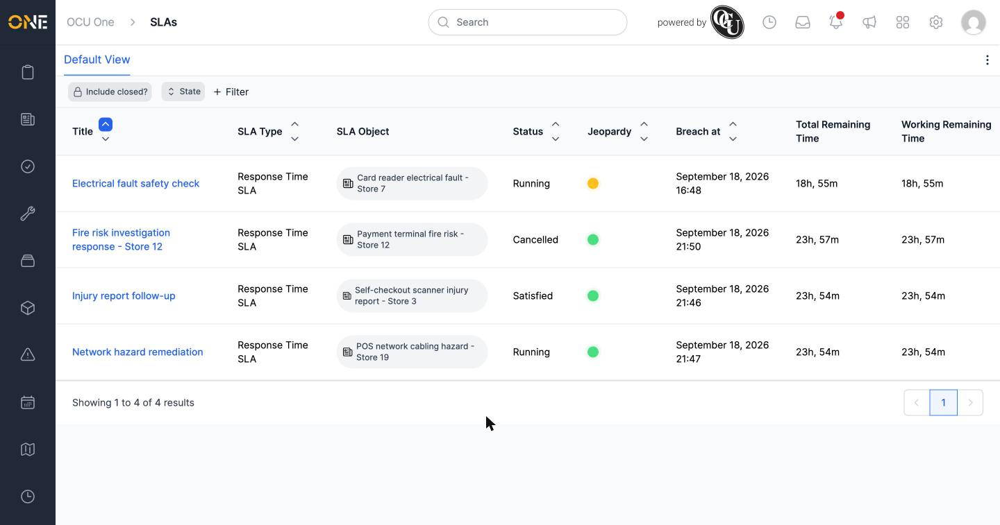

# Activating or deactivating an SLA

This guide covers activating and deactivating an SLA — but confirmed live, there's currently no way to do either from the app's interface.

## What's there today

An SLA's overview page shows Edit and Delete buttons, plus the Pause, Restart, Cancel, and Satisfy commands — but no option to deactivate it.

The main SLAs list has a **State** filter that can search by Active, Inactive, or Closed — so an inactive SLA can still be found by adding "Inactive" to that filter — but there's no toggle on any row to change an SLA's state, either.

## Things to know

- There is currently no way to deactivate an active SLA, or reactivate an inactive one, anywhere in the app.
- Deactivated SLAs are hidden from the SLAs list by default (unless you add "Inactive" to the **State** filter) — they still exist and keep running in the background, just out of sight.
